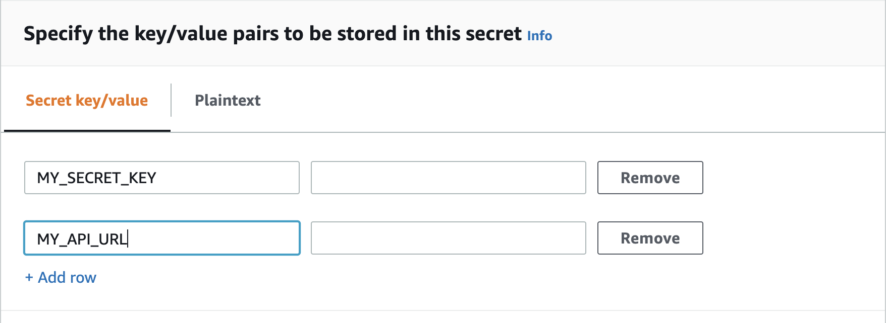

# Handling Secrets


How do you send an SMS when users click a button?

You find a JavaScript library that talks to an SMS provider. Configure your API keys, call the library, user gets an SMS. Yay!

3 months later you wake up to a $5,000 bill. Someone looked at your JavaScript code, took the API keys, and ran a spam campaign.


Orchestrating 3rd party services is where cloud functions shine. The perfect environment for glue code.

Isolated code that does *one* thing with no cruft. Runs on-demand, consumes no resources when not in use, scales near infinitely. Perfection.

**And it runs on a server where users can't see the code.** There's no right-click inspect, no JavaScript files downloaded, no user environment at all.

😍

## What is a secret

A secret is any piece of information you can't share. Passwords and secret API tokens. Keys with access to a special resource.

You can include semi secret configuration variables. URLs for parts of your system, ports of a database server, semi-hardcoded data, etc.

How secretive you have to be depends on context.

Configuration variables are okay to leak, if the system is otherwise secure. But they can give an attacker information about your system.

Production passwords for sensitive health information ... you don't even want your engineers to know those. Especially not former engineers.

## 3 ways to handle secrets

There are 3 ways to handle secrets. From least to most secure.

1. Hardcode values
2. Dotenv files
3. Secrets manager

Each method comes with different pros and cons. Pros in terms of security, cons in how cumbersome to use.

<div id="lock" />

## Hardcoded values in code

```typescript
MY_SECRET_KEY="f3q20-98facv87432q4"
```

Hardcoded secrets are the easiest to use and the least secure.

They're okay for prototyping. Reduce moving pieces and focus on the API integration. Ignore the yak shaving around your goal.

Code runs on the server and users won't be able to steal your secrets.

**But anyone with access to your code can see the secrets.** 

Share on GitHub and that includes the whole world. Bots always scrape GitHub looking for strings that look like keys. Your secret *will* be stolen.

AWS is paranoid enough that their own bot looks for secret keys. If they find yours, your AWS account gets locked. [Ask me how I know](https://swizec.com/blog/what-happens-when-you-push-aws-credentials-to-github/) 😅

Another issue with hardcoded keys is that they're hard to change. You have to re-deploy every time. And you're forced to use the same account for testing and production.

## Dotenv files

A step up from hardcoded keys are dotenv files – `.env`. Configuration files in your codebase that hold secrets.

```bash
# .env
MY_SECRET_KEY=f3q20-98facv87432q4
MY_API_URL=https://example.com
```

A `.env` file holds your secrets and configuration variables in one place. Makes them easier to use and change without searching through code.

**You should *not* store these in version control.** That's where the increased security comes from. 

The common approach is to:

1. Have a blank `.env` file with every variable stored in version control
2. Every engineer makes a copy
3. Fills out values from team members or a shared passwords manager

You'll never leak secrets to GitHub by accident. But they're unencrypted on everyone's laptop, difficult to change across a large team, and packaged into your deploys.

Anyone who breaks into your laptop or steals a deploy package from S3 can read the secrets.

On the bright side, dotenv files are easy to split between environments. You can have `.env.local`, `.env.production`, `.env.development` with different values for every secret. ✌️

### How to use .env files

Many frameworks support `.env` files by default. Populate the file and read values from `process.env`.

When using the Serverless Framework, you'll need a plugin: `serverless-dotenv-plugin`. Here's what you do.

Install the plugin:

```
yarn add serverless-dotenv-plugin
```

Enable in your serverless.yml config:

```yaml
# serverless.yml
plugins:
  - serverless-dotenv-plugin
```

Run deploy and access values with `process.env` 🤘

You can match environment specific files to deployments using the `stage: X` config. serverless-dotenv-plugin reads the `.env.X` file that matches your stage.

## Secrets manager

The most secure way to handle secrets is using a secrets manager.

A secrets manager works like the password manager in your browser. You have to authenticate to get access, re-authenticate *every time*, and secrets are encrypted when not in use.

You can even make your secrets double blind. *Nobody* needs to know their values.

Engineers can't see secrets in the code, they're not saved on anyone's laptop, you can't steal them from the server, and with the right configuration, secrets change every N days.


### How to use a secrets manager

If you're on Netlify or Vercel, their secrets system is a secrets manager. They control the run-time and inject those values into `process.env`.

On AWS, you'll have to partially build your own.

**First**, save your secrets in [AWS Secrets Manager](https://console.aws.amazon.com/secretsmanager/home). Follow the wizard, it's great.



You can store many secret values in 1 configuration. I recommend grouping by environment – dev, staging, production, etc – or using a logical grouping based on use. One secret per API you're accessing.

**Second**, give your code permission to access secrets.

```yaml
# serverless.yml
provider:
  # ...
  iamRoleStatements:
    - Effect: "Allow"
      Action:
        - "secretsmanager:GetSecretValue"
      Resource: "arn:aws:secretsmanager:${self:provider.region}:*"
```

You're giving permission to `GetSecretValue`, not to make changes. This is important. You do not want someone hacking into your system and locking you out.

Using an asterisk – `*` – for secret name is convenient. For more security, limit access to specific secrets.

**Third**, access your secrets at runtime.

```typescript
import { SecretsManager } from "aws-sdk"

const ssm = new SecretsManager({
  region: "us-east-1", // make sure this matches your region
})

const secret = await ssm
  .getSecretValue({ SecretId: "<your secret name>" })
  .promise()

const { MY_SECRET_KEY, MY_API_URL } = JSON.parse(secret?.SecretString)
```

Instantiates a new SSM client, gets your secret value, returns a JSON. Parse JSON, get secrets.

This is [an API call that might fail](https://serverlesshandbook.dev/robust-backend-design). Make sure to handle errors and fail correctly, if you can't get the secret.

You'll have to do this every time.

Fetching a fresh secret every time ensures that:

1. you get the latest value
2. you don't keep decrypted secrets in memory for long

However, this creates latency. You're making an API call that takes time. Not a lot, but not zero. 

You can memoize secrets values in Lambda memory. Rely on the ephemeral nature of your environment to forget.

## Conclusion

Choose the strategy that fits your use-case and safety needs.

I like to hardcode development values in the tinkering phase and *change keys afterwards*. You never know what you leaked.

When my code's ready, I put configuration values in `.env` files and secrets in Secrets Manager.