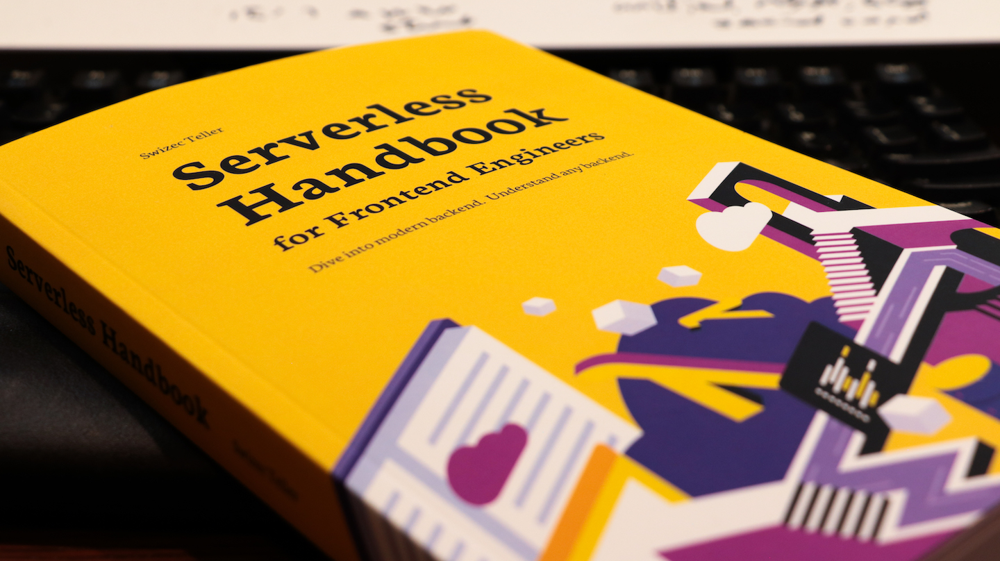
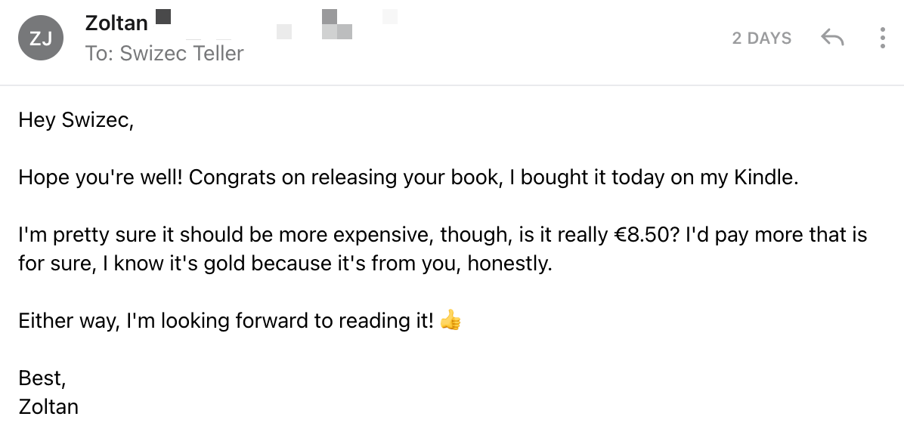

import { graphql } from "gatsby"
import {
  Box,
  Flex,
  Button,
  Container,
  Heading,
  Grid as ThemeUIGrid,
} from "theme-ui"
import {
  Avatar,
  Banner,
  Grid,
  GumroadButton,
  GumroadOverlay,
  TinyFormCK,
  Testimonial,
} from "@swizec/gatsby-theme-course-platform"
import { NavGrid, ChapterHeading, HomeTitle } from "../components/homepage"

export const pageQuery = graphql`
  query {
    ThaiWood: file(relativePath: { eq: "testimonial-avatars/thaiwood.png" }) {
      childImageSharp {
        fluid(maxWidth: 110, maxHeight: 110) {
          ...GatsbyImageSharpFluid
        }
      }
    }
    AlNotara: file(relativePath: { eq: "testimonial-avatars/alnotara.jpg" }) {
      childImageSharp {
        fluid(maxWidth: 110, maxHeight: 110) {
          ...GatsbyImageSharpFluid
        }
      }
    }
    MarekC: file(relativePath: { eq: "testimonial-avatars/MarekC.png" }) {
      childImageSharp {
        fluid(maxWidth: 110, maxHeight: 110) {
          ...GatsbyImageSharpFluid
        }
      }
    }
    AdamRackis: file(
      relativePath: { eq: "testimonial-avatars/adamrackis.jpeg" }
    ) {
      childImageSharp {
        fluid(maxWidth: 110, maxHeight: 110) {
          ...GatsbyImageSharpFluid
        }
      }
    }
    DavidWells: file(
      relativePath: { eq: "testimonial-avatars/davidwells.jpeg" }
    ) {
      childImageSharp {
        fluid(maxWidth: 110, maxHeight: 110) {
          ...GatsbyImageSharpFluid
        }
      }
    }
  }
`

<Banner>

<HomeTitle />

<Box sx={{ my: "auto", mb: 4 }} />

<ChapterHeading sx={{ mb: 2 }} />

<NavGrid>

- [Getting Started](/getting-started)
- [Serverless Pros & Cons](/serverless-pros-cons)
- [Choosing Providers](/serverless-flavors)
- [Create Good serverless DX](/serverless-dx)
- [Architecture principles](/serverless-architecture-principles)
- [Lambdas, queues, etc](/serverless-elements)
- [Robust backend design](/robust-backend-design)
- [Where to store data](/databases)
- [Creating a REST API](/serverless-rest-api)
- [Using GraphQL](/serverless-graphql)
- [Lambda pipelines](/lambda-pipelines)
- [Monitoring ](/serverless-monitoring)
- [Dev, QA, and prod](/dev-qa-prod)
- [Serverless performance](/serverless-performance)
- [Using Chrome puppeteer](/serverless-chrome-puppeteer)
- [Handling secrets](/handling-secrets)
- [Dealing with authentication](/serverless-authentication)
- [Glossary](/glossary)
- [Appendix: More databases](/appendix-more-databases)

</NavGrid>

</Banner>

<Container sx={{py: 3}}>

<Testimonial
  quote={
    <>
      I have really enjoyed the approach you've taken with the book. It's got me
      thinking practically about Serverless as a whole, but more specifically
      each aspect that contributes to a robust implementation of Serverless for
      production. <b>I read a third of the book the first night I had it!</b>
    </>
  }
  image={props.data.AlNotara.childImageSharp.fluid.src}
  name="Al Notara"
  company="freelance web developer"
/>

Hello! 👋

Are you a frontend engineer diving into backend? Do you have just that one bit of code that can't run in the browser? Something that deals with secrets and APIs?

https://www.youtube.com/watch?v=udqyBqCgLrU

That's what cloud functions are for my friend. You take a JavaScript function, run it on serverless, get a URL, and voila.

But that's easy mode. Any tutorial can teach you that.

**What happens when you wanna build a real backend?** When you want to understand what's going on? Have opinions on REST vs GraphQL, NoSQL vs. SQL, databases, queues, talk about performance, cost, data processing, deployment strategies, developer experience?

🤯

<Testimonial
  quote={
    <>
      

        Serverless Handbook is a wonderfully written introduction to serverless.
        It walks through serverless design principles and constraints, and
        discusses the various providers, and their tradeoffs. It moves on to
        cover a broad overview of the most common aws services, and how to use
        them with the Serverless framework.
      

      

        This book is a must-read for anyone new to serverless tech, looking to
        get up to speed.
      

    </>
  }
  image={props.data.AdamRackis.childImageSharp.fluid.src}
  name="Adam Rackis"
  company="engineer at Spotify"
/>

## Get your free chapter!

Access to this chapter immediately, extra free chapter and Serverless crash course in your email ✌️

<TinyFormCK
  copyBefore=""
  submitText="Send crash course! 💌"
  onSuccess={() => setTimeout(props.unlockCurrentPage, 2000)}
/>
 

## Dive into modern backend. Understand any backend

  <strong>Serverless Handbook</strong> shows you how with{" "}
  <strong>360 pages</strong> for people like you getting into backend
  programming.

With **digital + paperback content** Serverless Handbook has been more than 1 year in development. Lessons learned from 14 years of building production grade websites and webapps.

<Testimonial
  quote="With Serverless Handbook, Swiz teaches the truths of distributed systems – things will fail – but he also gives you insight on how to architect projects using reliability and resilience perspectives so you can monitor and recover."
  image={props.data.ThaiWood.childImageSharp.fluid.src}
  name="Thai Wood"
  company="author of Resilience Roundup"
/>

If you want to understand backends, grok serverless, or just get a feel for modern backend development, this is the book for you.

Serverless Handbook full of **color illustrations**, **code you can try**, and **insights you can learn**. But it's not a cookbook and it's not a tutorial.

Yes, there's a couple tutorials to get you started, to show you how it fits together, but the focus is on high-level concepts.

  <strong>Ideas</strong>, <strong>tactics</strong>, and{" "}
  <strong>mindsets</strong> that you need. Because every project is different.

The Serverless Handbook takes you _from your very first cloud function to modern backend mastery_. In the words of an early reader:

<Testimonial
  quote={
    <>
      

        Serverless Handbook taught me high-leveled topics. I don't like recipe
        courses and these chapters helped me to feel like I'm not a total noob
        anymore.
      

      

        The hand-drawn diagrams and high-leveled descriptions gave me the
        feeling that I don't have any critical "knowledge gaps" anymore.
      

    </>
  }
  image={props.data.MarekC.childImageSharp.fluid.src}
  name="Marek C."
  company="frontend engineer"
/>

>

If you can JavaScript, you can backend.

Plus it looks great on your bookshelf 😉

Cheers, 
~Swizec

<Grid gap={2} sx={{ fontWeight: 'bold', py: 3 }}>

- Get started with Serverless backend technologies
- Build your first backends, or your 10th in a new way ;)
- Designed for frontend engineers diving into backend tech for the first time
- Learn all about lambdas and queues and databases
- Build server-side technologies with JavaScript and TypeScript
- Support your apps with functions in the cloud
- A reference handbook that stands by your side as you work
- Pick and choose, read the chapters you need right now
- Access yours forever
- Live digital version with your Kindle or Paperback
- Available wherever Amazon sends books

</Grid>

<Testimonial
  quote={
    <>
      

        This handbook is a fantastic overview of what it means to embrace
        serverless technology. After explaining what the heck "serverless"
        really means, the book digs deep into the core elements of serverless in
        an easy-to-follow illustrative manner with ready deployable code!
      

      

        After learning about all the primitives (functions/queues/s3/etc.) you'd
        need as a serverless dev, the book also covers other critical
        operational aspects like observability, multi-staged deployments &
        handling secrets.
      

      

        It's a great book on using infrastructure-as-code tools like the
        serverless framework to achieve more with less.
      

      

        I'm highly impressed by Swizecs's approach to teaching devs how to adopt
        new serverless technology.
      

    </>
  }
  image={props.data.DavidWells.childImageSharp.fluid.src}
  name="David Wells"
  company="Serverless Framework core contributor"
/>

# What's in Serverless Handbook?

360 pages, 19 chapters, 6 full projects, hand-drawn diagrams, beautiful chapter art, best-looking cover in tech. ✌️

Watch the walkthrough or keep reading.

https://www.youtube.com/watch?v=WC-mEf4K9as&t=1772s

**Getting Started** walks you through the history of servers and _why_ serverless exists.

**Serverless Pros & Cons** helps you make informed decisions. Does serverless fit your project?

**AWS, Azure, Vercel, Netlify, or Firebase?‌** talks about choosing a provider and their tradeoffs.

**Good serverless DX** is about developer experience and how serverless helps you improve yours.

**Architecture principles** talks about distributed architectures and what you'll want to think about.

**Lambdas, queues, etc** explains the core building blocks of serverless backends and how you can use them.

**Robust backend design** continues with ideas on resilience and reliability.

**Where to store data** is all about different databases, their tradeoffs, and how they work. A core aspect of backend.

**Creating a REST API** explains what is REST and what it isn't, how to design a good API, and walks you through a tutorial with working code.

**Using GraphQL** shows you the benefits of GraphQL, when you should use it, and shares a tutorial where you deploy a serverless GraphQL API.

**Lambda pipelines** talks about distributed data processing at scale and how you might use serverless for the task. Great dive into robust architecture design.

**Monitoring serverless apps** gives you ideas on observability and how to ensure you'll know something's funky before users start yelling.

**Dev, QA, and prod** shares common strategies for scaling as a team, avoiding mishaps, and when you should use which.

**Serverless performance** touches cost optimization and focuses on how to keep your system fast and performant.

**Serverless Chrome puppeteer** was hard to fit in the book, but it's such a darling I couldn't let go. Shows you how to run Serverless Chrome for browser automation.

**Handling secrets** is an important topic on how to make sure your system doesn't get hacked. Leaking API keys is a common oopsie.

**Dealing with authentication** talks about authentication, why it's hard, and shows you how to roll your own or use a 3rd party provider.

**Glossary** defines commonly used words so you can look them up as you work.

**Appendix: More databases** is everything you ever wanted to know about different databases and how to use them.

Plus, Serverless Handbook _really_ looks great on your desk 😊

# Frequently Asked Questions

## Why Amazon?

She's a good book Friend and she deserves to hit the bestseller list.

https://twitter.com/Swizec/status/1377377288895918082

https://twitter.com/Swizec/status/1377618407869325320

🤘

## $9.99 for Kindle are you sure? Your book is worth more.

Not a fake question, I promise.

Amazon decided that kindle books should be $9.99. You get a 70% margin. Choose higher and your margin falls to 30%.

That means a $22 and a $9.99 book make the same revenue for the author. In that case making [Serverless Handbook](https://serverlesshandbook.dev) more accessible is the better choice 😊

## $49 for the paperback does it read itself??

Also not a fake question 😂

https://twitter.com/dxvgx/status/1377378042750844930

You know how most books you buy _aren't_ color and look like they were printed on toilet paper? This week I learned why.

That's right, it costs $26 to print each copy of [Serverless Handbook](https://serverlesshandbook.dev). Add distribution costs and Amazon overhead ...

I didn't want you to read toilet paper.

## Amazon doesn't show your book in my country

Sorry that's out of my hands 😔 I clicked all the buttons and flipped all the checkboxes and said _"Widest distribution possible please!"_

You can [try buying from Amazon's US store directly](https://www.amazon.com/dp/0578887916)

## I don't like Amazon, don't have Kindle, and killing trees is bad. How can I read Serverless Handbook?

You can buy the [live digital version on Gumroad](https://gum.co/NsUlA). Otherwise included with kindle/paperback purchase :)

<Box sx={{ mt: 10, textAlign: "center" }}>
  <a
    className="gumroad-button"
    href="https://gum.co/NsUlA"
    data-gumroad-single-product="true"
    target="_blank"
    rel="noopener noreferrer"
  >
    Get Serverless Handbook Digital
  </a>
</Box>

# Serverless Handbook in the wild

</Container>

<ThemeUIGrid gap={2} columns={[1, 3]} sx={{ px: [1, 3]}}>

https://twitter.com/raae/status/1405144389920432136

https://twitter.com/OlaHolstVea/status/1405158531007930369

https://twitter.com/opagani/status/1383293337029922820

https://twitter.com/dxvgx/status/1383209549809602570

https://twitter.com/flybayer/status/1383058155555393541

https://twitter.com/juanggiraldo/status/1382739132758290434

https://twitter.com/Kosai106/status/1381551022464765955

https://twitter.com/chagwood/status/1381368867289763846

https://twitter.com/Ryan_Magoon/status/1381053872370814979

https://twitter.com/code_e_averett/status/1380573360300646403

https://twitter.com/AdamRackis/status/1379184860586184704

https://twitter.com/TheAppyWriter/status/1378688644987371526

https://twitter.com/LukyVJ/status/1384835578932387841

https://twitter.com/mikedubcurry/status/1387920478166265857

https://twitter.com/AdamRackis/status/1388192278884331530

https://twitter.com/grepliz/status/1389677853013286913

https://twitter.com/royanger/status/1389976070959640578

https://twitter.com/__MateN/status/1390360722299817987

https://twitter.com/scisteffan/status/1391809403792371725

https://twitter.com/ErstonGreatman/status/1392229831203561472

</ThemeUIGrid>
