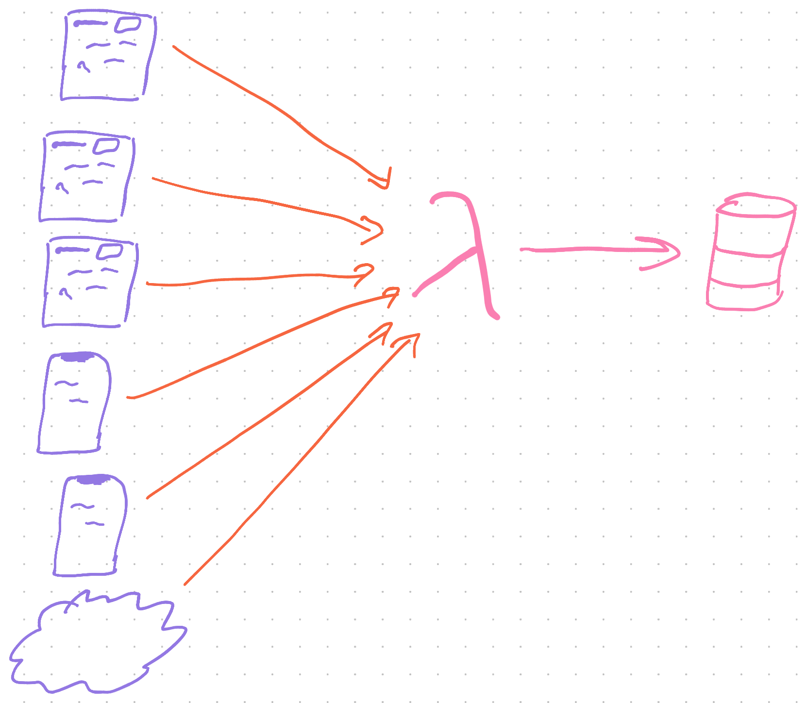
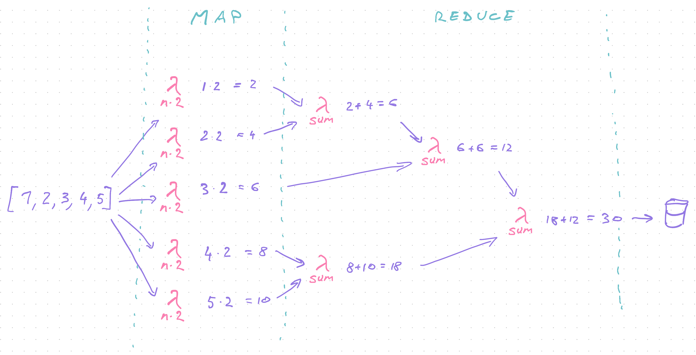

export const title = "Lambda pipelines for serverless data processing"

export const description = "Learn how to build a robust massively distributed data, event, or message processing pipeline"

export const image = '/chapter_headers/lambda-workflows.png'

# Lambda pipelines for serverless data processing


You get tens of thousands of events every hour. How do you process them?

You've got a shitload of data. What do you do?

Users send hundreds of messages per minute. Now what?

You could learn Elixir and Erlang – purpose built languages for message processing used in 4G routers and packet switching networks. But is that really where you want your career to go?

You could try [Kafka](https://kafka.apache.org/) or [Hadoop](https://hadoop.apache.org/). Tools designed for big data, used by large organizations for absolutely mind-boggling amounts of data. Are you ready for that?

You see, Elixir, Erlang, Kafka, Hadoop and such are all wonderful tools. If you know how to use them. For most, they're a pain in the ass with a significant learning curve and plenty of devops work to keep everything running.

They need you to maintain your own servers. We're trying to avoid that.

## Serverless data processing

What you can do instead is to use your existing skills to build a data processing pipeline.

I've used this approach to process millions of events per day in production with just 0.0007% data loss. A rate of 7 events lost per 1,000,000.

We used it to gather business and engineering analytics. Like a distributed `console.log` that writes to a central database.



This system would accept batches of events, process them to add additional info about user and server state, then save each event for easy retrieval.

It got so cushy, we even use it for tracing and debugging hard to track down bugs in production. Pepper your code with `console.log`, wait for an error, see what happened.


You can build a similar system to process almost anything.

Works great for problems you can split into independent tasks. Avoid for large inter-dependent operations.

Great for preparing data. Bad for machine learning.

<div id="lock" />

## Architectures for serverless data processing

You can think of serverless data processing as using `.map` and `.reduce` at scale. Inspired by Google's infamous [MapReduce programming model](https://en.wikipedia.org/wiki/MapReduce). The same approach used by big data processing frameworks behind the scenes.

Work happens in 3 steps:

1. Accept chunks of data
2. **Map** over your data
3. **Reduce** into output format

Let's say you're building a simple adder. Multiply every number by 2 then sum.

Dumb example but bear with me.

Using functional programming patterns in JavaScript, you'd build such an adder like this:

```javascript
const result = 
	[1,2,3,4,5] // input array
		.map(n => n*2) // multiply each by 2
		.reduce((sum, n) => sum+n, 0); // sum together
```

Each of those steps is independent. 

The `n => n*2` function doesn't need to know anything other than its `n`. The `(sum, n) => sum+n` function only needs the current `sum` and `n`.

That means you can distribute them. Run each on a separate Lambda in parallel. Thousands at a time.

You go from slow algorithm to as fast as a single operation. With infinite scale, you could process an array of 10,000,000 as fast as an array of 10.


There's limitations to that of course.

Lambda only allows up to 1000 invocations in parallel. Individual steps could be slow (like when transcoding video). And you're ultimately limited by the `reduce` step.

Performance is best when reduce is un-necessary. Performance is slowest when reduce needs to iterate over every element in 1 operation.

Our adder is commutative so we can split the reduce step into parallel operations using chunks of data.



In practice you'll find some transformations don't need a reduce step and some require multiple `map` steps. They all follow this basic architecture. :)

And for the comp sci nerds 👉 this has no impact on [big-O complexity](https://en.wikipedia.org/wiki/Big_O_notation). Underlying algorithm is just as complex, you're just changing its real-world performance.

## Build a distributed data processing pipeline

Let's build that adder and learn how to construct a robust massively distributed data processing pipeline. We're keeping the operation itself simple so we can focus on the architecture.

This is the JavaScript code we're distributing.

Following principles from the [Architecture Principles](/serverless-architecture-principles) chapter we're building a system that is:

- easy to understand
- robust against errors
- debuggable
- replayable
- always inspectable

We're going to use 3 [Serverless Elements](/serverless-elements) to get there:

1. lambdas
2. queues
3. storage

