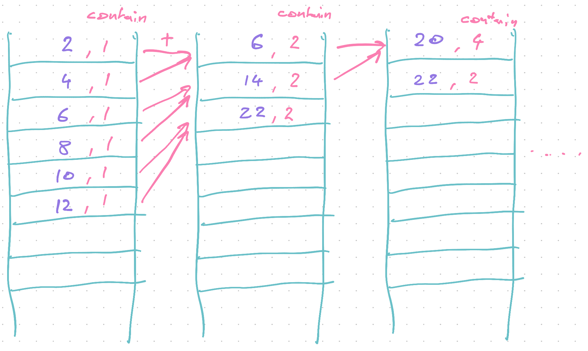

export const title = "Lambda pipelines for serverless data processing"

export const description =
  "Learn how to build a robust massively distributed data, event, or message processing pipeline"

export const image = "/chapter_headers/lambda-workflows.png"

# Lambda pipelines for serverless data processing


You get tens of thousands of events every hour. How do you process them?

You've got a shitload of data. What do you do?

Users send hundreds of messages per minute. Now what?

You could learn Elixir and Erlang – purpose built languages for message processing used in 4G routers and packet switching networks. But is that really where you want your career to go?

You could try [Kafka](https://kafka.apache.org/) or [Hadoop](https://hadoop.apache.org/). Tools designed for big data, used by large organizations for mind-boggling amounts of data. Are you ready for that?

Elixir, Erlang, Kafka, Hadoop and such are all wonderful tools. If you know how to use them. For most, they're a pain in the ass with a significant learning curve and plenty of devops work to keep them running.

You have to maintain servers, write code in obscure languages, and deal with problems we're trying to avoid.

## Serverless data processing

What you can do instead is to use your existing skills to build a data processing pipeline.

I've used this approach to process millions of daily events in production with just 0.0007% data loss. A rate of 7 events lost per 1,000,000.[^1]

We used it to gather business and engineering analytics. Like a distributed `console.log` that writes to a central database.


This system would accept batches of events, process them to add additional info about user and server state, then save each event for easy retrieval.

It got so cushy, we even use it for tracing and debugging hard to track down bugs in production. Pepper your code with `console.log`, wait for an error, see what happened.


You can build a similar system to process almost anything.

Works great for problems you can split into independent tasks. Avoid for large inter-dependent operations.

Great for preparing data. Bad for machine learning.

## Architectures for serverless data processing

You can think of serverless data processing as using `.map` and `.reduce` at scale. Inspired by Google's infamous [MapReduce programming model](https://en.wikipedia.org/wiki/MapReduce). The same approach used by big data processing frameworks behind the scenes.

Work happens in 3 steps:

1. Accept chunks of data
2. **Map** over your data
3. **Reduce** into output format

Let's say you're building an adder. Multiply every number by 2 then sum.

<div id="lock" />

Using functional programming patterns in JavaScript, you'd write something like this:

```javascript
const result = [1, 2, 3, 4, 5] // input array
  .map((n) => n * 2) // multiply each by 2
  .reduce((sum, n) => sum + n, 0) // sum together
```

Each of those steps is independent.

The `n => n*2` function doesn't need to know anything other than its `n`. The `(sum, n) => sum+n` function only needs the current `sum` and `n`.

That means you can distribute them. Run each on a separate Lambda in parallel. Thousands at a time.

You go from slow algorithm to as fast as a single operation. With infinite scale, you could process an array of 10,000,000 as fast as an array of 10.


There's limitations of course.

Lambda limits you to 1000 invocations in parallel. Individual steps could be slow (like when transcoding video). And you're fundamentally limited by the `reduce` step.

Performance is best when reduce is un-necessary. Performance is slowest when reduce needs to iterate over every element in a single call and can't be distributed.

Our adder is commutative so we can split the reduce step into parallel operations using chunks of data.


In practice you'll find some transformations don't need a reduce step and some need multiple `map` steps. They all follow this basic architecture. :)

And for the comp sci nerds 👉 this has no impact on [big-O complexity](https://en.wikipedia.org/wiki/Big_O_notation). Underlying algorithm is just as complex, you're changing its real-world performance.

## Build a distributed data processing pipeline

Let's build that adder and learn how to construct a robust massively distributed data processing pipeline. We're keeping the operation itself simple so we can focus on the architecture.

This is the JavaScript code we're distributing.

```javascript
const result = [1, 2, 3, 4, 5] // input array
  .map((n) => n * 2) // multiply each by 2
  .reduce((sum, n) => sum + n, 0) // sum together
```

Following principles from the [Architecture Principles](/serverless-architecture-principles) chapter, we're building a system that is:

- easy to understand
- robust against errors
- debuggable
- replayable
- always inspectable

We're going to use 3 [Serverless Elements](/serverless-elements) to get there:

1. lambdas
2. queues
3. storage

You can see the [full code on GitHub](https://github.com/Swizec/serverlesshandbook.dev/tree/master/examples/serverless-data-pipeline-example). I'll share the important parts here.

Throughout, I'll share some ideas how you can make the system even more robust.

### The elements

We're using 3 lambdas, 2 queues, and 2 DynamoDB tables.

**3 Lambdas**

1. `sumArray` – this is our API-facing lambda. It accepts a request and kicks off the process
2. `timesTwo` – this is the map lambda. It accepts a number, multiplies by 2, and triggers the next step.
3. `reduce` – this lambda combines intermediary steps into the final result. It is the most complex.

Our lambdas are all written in TypeScript and each does just 1 part of the process. That keeps them easier to understand.

**2 Queues**

1. `TimesTwoQueue` – holds messages from `sumArray` and uses them to trigger `timesTwo`.
2. `ReduceQueue` – holds messages from `timesTwo` and uses them to trigger `reduce`. Also used by `reduce` to trigger itself.

We're using [SQS – Simple Queue Service – queues](https://aws.amazon.com/sqs/) for their reliability. An SQS queue stores messages for up to 14 days and keeps retrying your Lambda until it succeeds.

When something goes wrong, you don't have to think about it. There's almost no chance a message gets lost.

Messages only vanish when your Lambda accepts a message, fails to process it, and doesn't throw an error. SQS interprets this as success.

You can configure max retries and how long a message should stick around. When it exceeds those deadlines, you can configure a so-called Dead Letter Queue to store the message instead.

DLQ's are useful for alternate processing of bad messages. Send an alert to yourself, store it in a different table, _something_ that helps you debug what's going on.

**2 tables**

1. `scratchpad table` for intermediary results from `timesTwo`. Using a table made `reduce` easier to implement and debug.
2. `sums table` for final results

### Step 1 – the API

Before you can process data, you need to get data into the system. We use a [Serverless REST API](/serverless-rest-api) for this purpose.

```yaml
# serverless.yml
functions:
  sumArray:
    handler: dist/sumArray.handler
    events:
      - http:
          path: sumArray
          method: POST
          cors: true
    environment:
      timesTwoQueueURL:
        Ref: TimesTwoQueue
```

`sumArray` is an endpoint that accepts POST requests and pipes them into the `sumArray.handler` function. We give it the URL for our `TimesTwoQueue` as an environment variable.

We define the queue like this:

```yaml
# serverless.yml
resources:
  Resources:
    TimesTwoQueue:
      Type: "AWS::SQS::Queue"
      Properties:
        QueueName: "TimesTwoQueue-${self:provider.stage}"
        VisibilityTimeout: 60
```

It's an SQS queue postfixed with the current stage so we can split between production and development.

The [`VisibilityTimeout`](https://docs.aws.amazon.com/AWSSimpleQueueService/latest/SQSDeveloperGuide/sqs-visibility-timeout.html) says that when your Lambda accepts a message, it has 60 seconds to process it. After that SQS will assume you never _actually_ received the message and give it to someone else.

Distributed systems are fun like that.

The `sumArray.ts` Lambda accepting requests looks like this:

```typescript
// src/timesTwo.ts

export const handler = async (event: APIGatewayEvent): Promise<APIResponse> => {
  const arrayId = uuidv4()

  if (!event.body) {
    return response(400, {
      status: "error",
      error: "Provide a JSON body",
    })
  }

  const array: number[] = JSON.parse(event.body)

  // split array into elements
  // trigger timesTwo lambda for each entry
  for (let packetValue of array) {
    await sendSQSMessage(process.env.timesTwoQueueURL!, {
      arrayId,
      packetId: uuidv4(),
      packetValue,
      arrayLength: array.length,
      packetContains: 1,
    })
  }

  return response(200, {
    status: "success",
    array,
    arrayId,
  })
}
```

Get API request, create an `arrayId`, parse JSON body, iterate over the input, return success and the new `arrayId`. Consumers can use this ID to later identify their result.

### Triggering the next step

We turn each element of the input array into a processing packet and send it to our SQS queue as a message.

```typescript
// src/timesTwo.ts

for (let packetValue of array) {
  await sendSQSMessage(process.env.timesTwoQueueURL!, {
    arrayId,
    packetId: uuidv4(),
    packetValue,
    arrayLength: array.length,
    packetContains: 1,
  })
}
```

Each packet contains:

- `arrayId` to identify which input it belongs to
- `packetId` to identify the packet itself
- `packetValue` as the value. You could use this to store entire JSON blobs or whatever is meaningful to you.
- `arrayLength` to help `reduce` know how many packets to expect
- `packetContains` to help `reduce` know when it's done

Almost everything here is metadata to help our processing pipeline. `packetValue` is the real data.

[`sendSQSMessage`](https://github.com/Swizec/serverlesshandbook.dev/blob/master/examples/serverless-data-pipeline-example/src/utils.ts#L11) is a helper method that sends and SQS message using the AWS SDK.

### Step 2 – the map

Our map step uses the `timesTwo` lambda, which handles each packet in isolation.

```yaml
# serverless.yml
functions:
  timesTwo:
    handler: dist/timesTwo.handler
    events:
      - sqs:
          arn:
            Fn::GetAtt:
              - TimesTwoQueue
              - Arn
          batchSize: 1
    environment:
      reduceQueueURL:
        Ref: ReduceQueue
```

`timesTwo` handles events from the `TimesTwoQueue` using the `timesTwo.handler` method. It gets the `reduceQueueURL` as an environment variable so it can trigger the next step.

AWS and SQS ensure our lambda gets called and keeps retrying when something goes wrong. Perfect to let you re-deploy when there's a bug ✌️

The lambda itself looks like this:

```typescript
// src/timesTwo.ts

export const handler = async (event: SQSEvent) => {
  // grab messages from queue
  // depending on batchSize there could be multiple
  let packets: Packet[] = event.Records.map((record: SQSRecord) =>
    JSON.parse(record.body)
  )

  // iterate packets and multiply by 2
  // this would be a more expensive operation usually
  packets = packets.map((packet) => ({
    ...packet,
    packetValue: packet.packetValue * 2,
  }))

  // store each result in scratchpad table
  // in theory it's enough to put them on the queue
  // an intermediary table makes the reduce step easier to implement
  await Promise.all(
    packets.map((packet) =>
      db.updateItem({
        TableName: process.env.SCRATCHPAD_TABLE!,
        Key: { arrayId: packet.arrayId, packetId: packet.packetId },
        UpdateExpression:
          "SET packetValue = :packetValue, arrayLength = :arrayLength, packetContains = :packetContains",
        ExpressionAttributeValues: {
          ":packetValue": packet.packetValue,
          ":arrayLength": packet.arrayLength,
          ":packetContains": packet.packetContains,
        },
      })
    )
  )

  // trigger next step in calculation
  const uniqueArrayIds = Array.from(
    new Set(packets.map((packet) => packet.arrayId))
  )

  await Promise.all(
    uniqueArrayIds.map((arrayId) =>
      sendSQSMessage(process.env.reduceQueueURL!, arrayId)
    )
  )

  return true
}
```

Accept an event from SQS, parse JSON body, do the work, store intermediary results, trigger `reduce` step for each input.

Depending on your `batchSize` config, SQS might call your lambda with multiple messages. This is to help you optimize cost and find the right balance between number of executions and execution time.

### Triggering the next step

Triggering the next step happens in 2 parts here

1. store intermediary result
2. trigger next lambda

Storing intermediary results makes implementing the next lambda easier and means we're kind of implementing a queue on top of DynamoDB. That's okay because it also makes the system easier to debug.

Something went weird? Check the intermediary table, see what's up.

To store results, we iterate over them, fire a DynamoDB `updateItem` query, and await all queries to finish.

```typescript
// src/timesTwo.ts

// store each result in scratchpad table
// in theory it's enough to put them on the queue
// an intermediary table makes the reduce step easier to implement
await Promise.all(
  packets.map((packet) =>
    db.updateItem({
      TableName: process.env.SCRATCHPAD_TABLE!,
      Key: { arrayId: packet.arrayId, packetId: packet.packetId },
      UpdateExpression:
        "SET packetValue = :packetValue, arrayLength = :arrayLength, packetContains = :packetContains",
      ExpressionAttributeValues: {
        ":packetValue": packet.packetValue,
        ":arrayLength": packet.arrayLength,
        ":packetContains": packet.packetContains,
      },
    })
  )
)
```

Each entry in this table is uniquely identified with a combination of `arrayId` and `packetId`.

_Triggering_ the next step happens in another loop.

```typescript
// src/timesTwo.ts

// trigger next step in calculation
const uniqueArrayIds = Array.from(
  new Set(packets.map((packet) => packet.arrayId))
)

await Promise.all(
  uniqueArrayIds.map((arrayId) =>
    sendSQSMessage(process.env.reduceQueueURL!, arrayId)
  )
)
```

We use an ES6 Set to get a list of unique array ids from our input message. You never know what gets jumbled up on the queue and you might receive multiple inputs in parallel.

Distributed systems are fun :)

For each unique input, we trigger a reduce lambda via `ReduceQueue`. Having a single `reduce` stream makes some things easier for this example. You should go for parallelism in real life.

### Step 3 – reduce

Combining intermediary steps into the final result is the most complex part of our example.

The simplest approach is to take the entire input and combine in 1 step. With large datasets this becomes impossible, however. Especially if combining elements is a costly operation.

Instead, you can combine 2 elements at a time and run your reduce step in parallel.

Fine-tuning for number of invocations and speed of execution will result in an N somewhere between 2 and All. Best numbers depend on what exactly you're doing.

Our reduce function uses the `scratchpad table` as a queue:

1. Take 2 elements
2. Combine
3. Write the new element
4. Delete the 2 originals

Like this:



At each invocation we take 2 packets like this:

```
{
	arrayId: // ...
	packetId: // ...
	packetValue: 2,
	packetContains: 1,
	arrayLength: 10
}

{
	arrayId: // ...
	packetId: // ...
	packetValue: 4,
	packetContains: 1,
	arrayLength: 10
}
```

And combine them into a new packet

```
// +
{
	arrayId: // ...
	packetId: // ...
	packetValue: 6
	packetContains: 2,
	arrayLength: 10
}
```

When the count of included packets – `packetContains` – matches the total array length – `arrayLength` – we know this is the final result and write it into the results table.

Like I said, this is the complicated bit.

### The reduce step code

In code, the reduce step starts like any other lambda:

```typescript
// src/reduce.ts
export const handler = async (event: SQSEvent) => {
  // grab messages from queue
  // depending on batchSize there could be multiple
  let arrayIds: string[] = event.Records.map((record: SQSRecord) =>
    JSON.parse(record.body)
  )

  // process each ID from batch
  await Promise.all(arrayIds.map(reduceArray))
}
```

Grab `arrayId`s from the SQS event and wait until all `reduceArray` calls are done.

Then the `reduceArray` function does its job:

```typescript
// src/reduce.ts

async function reduceArray(arrayId: string) {
  // grab 2 entries from scratchpad table
  // IRL you'd grab as many as you can cost-effectively process in execution
  // depends what you're doing
  const packets = await readPackets(arrayId)

  if (packets.length > 0) {
    // sum packets together
    const sum = packets.reduce(
      (sum: number, packet: Packet) => sum + packet.packetValue,
      0
    )

    // add the new item sum to scratchpad table
    // we do this first so we don't delete rows if it fails
    const newPacket = {
      arrayId,
      packetId: uuidv4(),
      arrayLength: packets[0].arrayLength,
      packetValue: sum,
      packetContains: packets.reduce(
        (count: number, packet: Packet) => count + packet.packetContains,
        0
      ),
    }
    await db.updateItem({
      TableName: process.env.SCRATCHPAD_TABLE!,
      Key: {
        arrayId,
        packetId: uuidv4(),
      },
      UpdateExpression:
        "SET packetValue = :packetValue, arrayLength = :arrayLength, packetContains = :packetContains",
      ExpressionAttributeValues: {
        ":packetValue": newPacket.packetValue,
        ":arrayLength": newPacket.arrayLength,
        ":packetContains": newPacket.packetContains,
      },
    })

    // delete the 2 rows we just summed
    await cleanup(packets)

    // are we done?
    if (newPacket.packetContains >= newPacket.arrayLength) {
      // done, save sum to final table
      await db.updateItem({
        TableName: process.env.SUMS_TABLE!,
        Key: {
          arrayId,
        },
        UpdateExpression: "SET resultSum = :resultSum",
        ExpressionAttributeValues: {
          ":resultSum": sum,
        },
      })
    } else {
      // not done, trigger another reduce step
      await sendSQSMessage(process.env.reduceQueueURL!, arrayId)
    }
  }
}
```

Gets 2 entries from the DynamoDB table[^2] and combines them into a new packet.

This packet _must_ have a new `packetId`. It's a new entry into the faux processing queue on DynamoDB.

Insert that back and if that succeeds, remove the previous 2 elements using their `arrayId/packetId` combination.

If our new `packetContains` is greater than or equal to the total `arrayLength`, we know the computation is now complete. Write results to the final table.

## Conclusion

In conclusion, Lambda processing pipeline are a powerful tool that can help you process large amounts of data or user events in near real-time. I have yet to find a way to swamp one of these in production so it started lagging.

Usually slow downs happen where you have to introduce throttling to limit how fast you're processing because a downstream system can't take that much load.

✌️

[^1]: Our dataloss happened because of our use of Postgres. Sometimes in some cases it would fail to insert a row, but wouldn't throw an error. We mitigated that with some workarounds and some of the problem remained. At that point we decided this was okay enough.
[^2]: We use a `Limit: 2` argument to limit how much of the table we scan through. Don't need more than 2, don't read more than 2. Keeps everything snappy
