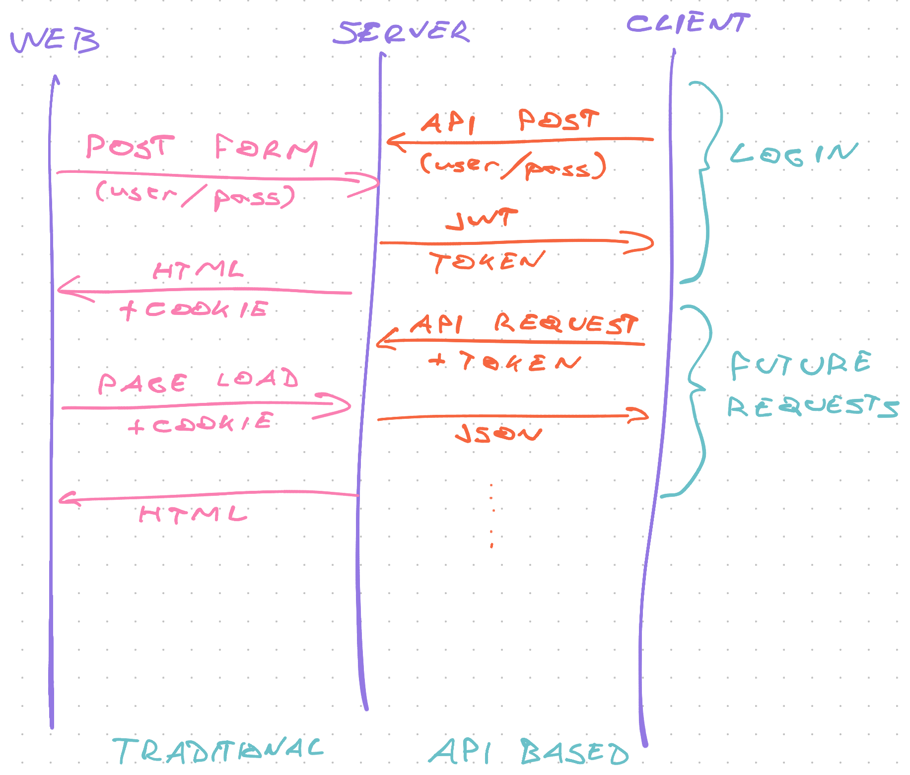
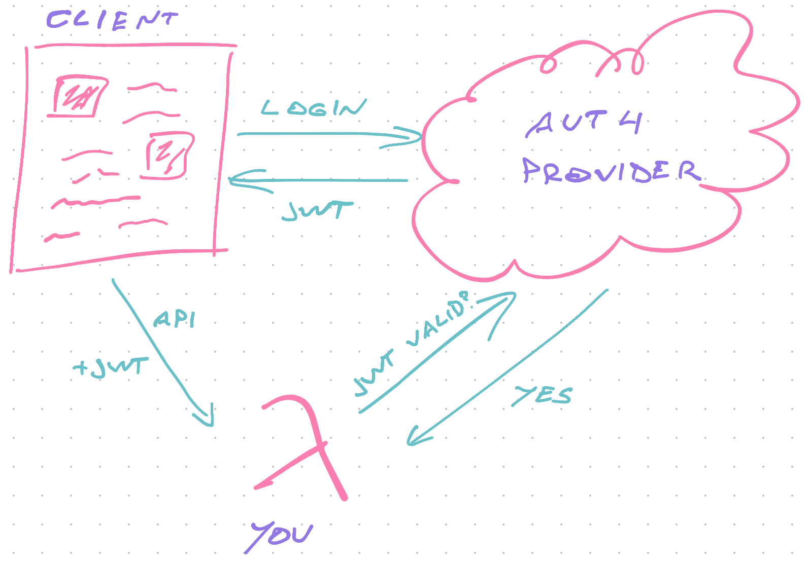

# Serverless authentication


You've got a feature that only a few people should use. How do you keep it safe?

Authentication. 

It's easy in theory: Save an identifier on the client, send with every request, check against a stored value on the server.

In practice, authentication is hard.

Where do you save the identifier? How does the client get it? What authentication scheme do you use? What goes on the server? How do you keep it secure? What if you need to run authenticated code without the user?

Authentication is a deep rabbit hole. In this chapter, we look at the core ideas and build 2 examples.

## What is authentication

A typical authentication system deals with everything from user identity, to access control, authorization, and keeping your system secure.

It's a big job :)

**Identity** answers the "Who are you?" question. The most important aspect of authentication systems. Can be as simple as an honor-based input field.

**Access control** answers the "Can you access this system?" question. You ask for proof of identity (like a password) and unlock restricted parts of your app.

**Authorization** answers the "Which parts of the system can you use?" question. Two schemes are common: role-based and scope-based authorization. They specify which users can do what.

**Security** underlies your authentication system. Without security, you've got nothing. 

Typical concerns include leaking authentication tokens, interception attacks, impersonating users, revoking access, how your data behaves, and whether you can identify a breach.

### Factors of authentication

Proof of identity is key to good authentication.

> something the user *knows*, something the user *has*, something the user *is*

Each [authentication factor](https://en.wikipedia.org/wiki/Authentication#Authentication_factors) covers a different overlapping proof of identity. 2 factors is considered safe, 3 is best. Typical is 1 🙈

**Knowledge factors** include hidden pass phrases like passwords, PINs, and security questions. You know the answer and verify the user knows too.

**Ownership factors** include ID cards, token apps on your phone, physical tokens, and email inboxes. You ask the user to prove they have something only they should have.

**Inference factors** include biometric identifiers like fingerprints, DNA, hand-written signatures, and other markers that uniquely identify a person.

Credit card + PIN is 2-factor authentication. You own the card and know the PIN.

Username + password is 1-factor. You know the username and know the password.

Passwordless email/sms login is 2-factor. You know the username and own the email inbox. Proof by unique link or pin.

### Role-based and scope-based authorization

The 2nd job after access control is authorization. What can *this* user do?

Two flavors of authorization are common:

- **role-based** authorization depends on user types. Admins vs. paid users vs. freeloaders.
- **scope-based** authorization depends on fine-grained user properties. Enable subscriber dashboard or don't.

Technically they're the same – a user property. It's like utility vs. semantic classes in CSS. Debate until you're blue in the face then pick what feels right :)

Role-based authorization is perfect for small projects. You need admins and everyone else. Being an admin comes with inherent rights.

Scope-based authorization is perfect for large projects with granular needs. Yes you're an admin, but admin of what?

In practice you'll see that roles get clunky and scopes are tedious. Like when I had permission to configure CloudFront, but not to see what I'm doing. 🙃

At an organizational level you end up with roles that act as bags of scopes. Engineers get scopes x, y, z, admins can do so and so, and users get user things.

## Build your own auth

Let's build a basic serverless auth meant to be used as an API. It's the best way to get a feel for what it takes.

I'll share and explain the important code, you can [see the full example on GitHub](https://github.com/Swizec/serverlesshandbook.dev/tree/master/examples/serverless-auth-example). Use [this CodeSandbox app](https://codesandbox.io/s/serverless-auth-example-9ipfb) to try it out.

https://codesandbox.io/s/serverless-auth-example-9ipfb

You can test your implementation too. Change the Lambda base URL 😊

### The auth flow

Traditional auth and API auth use a different medium to exchange tokens. Traditional auth uses cookies, API auth relies on [JSON Web Tokens (JWT)](https://jwt.io/) and `Authorization` headers.



The API approach is useful in more situations. Works great with modern JavaScript apps, mobile clients, and other servers.

1. User sends username and password
2. Server checks against database
3. Returns fresh JWT token
4. Client adds token to every future request
5. Server checks token is valid before responding

This flow is secure because of the HTTPS encryption used at the protocol level. Without it, attackers could steal passwords and tokens by sniffing API requests.

Always use HTTPS and remember: *A JWT token on its own lets you impersonate a user*.

### A note on password safety

You need to know the user's password to verify the user got it right. But you should never store a plain password.

A typical approach is to store passwords as a [one-way hash](https://en.wikipedia.org/wiki/Cryptographic_hash_function). Feed password into a cryptographic function, get a unique value that's impossible to reverse.

Since the invention of [rainbow tables](https://en.wikipedia.org/wiki/Rainbow_table) even one-way hashing is no longer secure. You can fight that with a salt.

```typescript
// src/util.ts

// Hashing your password before saving is critical
// Hashing is one-way meaning you can never guess the password
// Adding a salt and the username guards against common passwords
export function hashPassword(username: string, password: string) {
  return sha256(
    `${password}${process.env.SALT}${username}${password}`
  ).toString()
}
```

Without a salt, the string `password` turns into the same hash for every app. Precomputed rainbow tables work like magic.

With a salt, the string `password` hashes uniquely to *your* app. Attackers need to build new rainbow tables. *If they can find the salt.*

Add the username and each hash is unique to your app *and* the user. Attackers need new rainbow tables for every user and that's not worth it.

That's when guessing becomes the easier approach. You can fight that with limits and timeouts on your login API.

### Environment variables

We need 2 variables to build an auth system:

- a unique SALT for password hashing
- a unique JWT_SECRET for signing JWT tokens

Define them in `serverless.yml` to keep things simple. Use [proper secrets handling](/handling-secrets) for production.

```yaml
# serverless.yml
service: serverless-auth-example

provider:
  # ...
  environment:
    SALT: someRandomSecretString_pleaseUseProperSecrets:)
    JWT_SECRET: useRealSecretsManagementPlease
```

Never share these with anyone. `JWT_SECRET` is all an attacker needs to impersonate a user.

### `auth.login` function

Users need to be able to login – send an API request with their username and password to get a JWT token. We'll keep it similar to the [REST API chapter](/serverless-rest-api).

```yaml
# serverless.yml

functions:
  login:
    handler: dist/auth.login
    events:
      - http:
          path: login
          method: POST
          cors: true
```

We've got a Lambda function called `login` that accepts POST requests and lives in the `auth` file.

```typescript
// dist/auth.ts

// Logs you in based on username/password combo
// Creates user on first login
export const login = async (event: APIGatewayEvent) => {
  const { username, password } = JSON.parse(event.body || "{}")

  // respond with error if username/password undefined

  // find user in database
  let user = await findUser(username)

  if (!user) {
    // user was not found, create
    user = await createUser(username, password)
  } else {
    // check credentials
    if (hashPassword(username, password) !== user.password) {
      // 🚨
      return response(401, {
        status: "error",
        error: "Bad username/password combination",
      })
    }
  }

  // user was created or has valid credentials
  const token = jwt.sign(omit(user, "password"), process.env.JWT_SECRET!)

  return response(200, {
    user: omit(user, "password"),
    token,
  })
}
```

We grab `username` and `password` from request body and look for the user. `findUser` runs a database query, in our case a DynamoDB `getItem`.

If the user wasn't found, we create one and make sure we `hashPassword()` before saving.

If the user was found, we verify credentials by hashing the password and comparing with the stored value. We know passwords match when our `hashPassword()` method creates the same hash.

This means you can never change your `hashPassword()` method unless you force users to reset their password.

Then we sign a JWT token with our secret and send it back. Make sure you don't save sensitive data like passwords in anything that goes to the client.

```typescript
	// user was created or has valid credentials
  const token = jwt.sign(omit(user, "password"), process.env.JWT_SECRET!)

  return response(200, {
    user: omit(user, "password"),
    token,
  })
```

We're using the [`jsonwebtoken`](https://github.com/auth0/node-jsonwebtoken) library to create the token.

You can [try it in the CodeSandbox](https://codesandbox.io/s/serverless-auth-example-9ipfb). Pick a username, add a password, see it work. Then try with a different password.

### `auth.verify` function

For authentication to work across page reloads, you have to store the JWT token. These can expire or get revoked by the server.

Clients use the `verify` API to validate a session every time they initialize. A page reload on the web.

When you know the session is valid, you treat the user as logged in. Otherwise ask for a username/password to continue.

The `serverless.yml` definition is almost the same:

```yaml
# serverless.yml

functions:
	# ...
  verify:
    handler: dist/auth.verify
    events:
      - http:
          path: verify
          method: POST
          cors: true
```

Function called `verify` that accepts POST requests and lives in `auth.ts`.

```typescript
// src/auth.ts

// Verifies you have a valid JWT token
export const verify = async (event: APIGatewayEvent) => {
  const { token } = JSON.parse(event.body || "{}")

  // respond with error if token undefined

  try {
    jwt.verify(token, process.env.JWT_SECRET!)
    return response(200, { status: "valid" })
  } catch (err) {
    return response(401, err)
  }
}
```

Verifying a JWT token with [`jsonwebtoken`](https://github.com/auth0/node-jsonwebtoken) throws an error for bad tokens. Anything from a bad secret, to tampering, and token expiration.

### `private.hello` function

This is where it gets fun – verifying authentication for private APIs.

We make an API that says hello to the user.

```yaml
# serverless.yml

functions:
  privateHello:
    handler: dist/private.hello
    events:
      - http:
          path: private
          method: GET
          cors: true
```

Function accepts GET requests and lives in the `private.ts` file. It looks like this:

```typescript
// src/private.ts

export async function hello(event: APIGatewayEvent) {
  // returns JWT token payload
  const authorized = checkAuth(event)

  if (authorized) {
    const user = authorized as User

    return response(200, {
      message: `Hello ${user.username}`,
    })
  } else {
    return response(401, {
      status: "error",
      error: "This is a private resource",
    })
  }
}
```

The `checkAuth` method takes our request, verifies its JWT token, and returns the payload. A user in our case.

If user is authorized, we say hello, otherwise return an error.

`checkAuth` is where we read a token from the `Authorization` header and verify it looks good.

```typescript
// src/util.ts

// Used to verify a request is authenticated
export function checkAuth(event: APIGatewayEvent): boolean | User {
  const bearer = event.headers["Authorization"]

  if (bearer) {
    try {
      const decoded = jwt.verify(
        // Bearer prefix from Authorization header
        bearer.replace(/^Bearer /, ""),
        process.env.JWT_SECRET!
      )

      // We saved user info in the token
      return decoded as User
    } catch (err) {
      return false
    }
  } else {
    return false
  }
}
```

The `Authorization` header holds our token – `Authorization: Bearer <token>`. If the header is empty, we return `false`.

We use the `jwt.verify()` call to verify the provided token was valid. This validates that it was created with our secret, wasn't tampered with, and hasn't expired.

`verify` decodes the token for us, which means we can see the user's username without a database query. 🤘

## Use an auth provider

An auth provider like Auth0, Okta, AWS Cognito, Firebase Auth, and others makes your integration more complex. But *you* don't have to worry about password security and user management.

And if a big provider gets hacked, you're one among thousands of hacked apps. Feels less bad eh? 😇



The key difference with using a provider is the 3-way trust model. Users authenticate with a provider and send you a JWT token. You ask the provider if it's valid.

Crucially, the auth provider doesn't trust *you* either. you have to validate yourself before you can validate user tokens. A process similar to logging in.

Exact integration depends on your provider of choice. I recommend following their documentation.

If performance is critical, remember that a 3rd party provider adds an API request to every call in your app.

### An example integration

Here's what I do to create users on Auth0 when you purchase a course on Gumroad. It's the `provider <> lambda` part of the flow. 

The course platform runs in the browser, which means the `user <> lambda` connection wasn't necessary. Another benefit of using a provider 😊

Gumroad sends a request to AWS Lambda (as a webhook) on every purchase. It runs this function:

```typescript
export const pingHandler = async (
    event: APIGatewayEvent
): Promise<APIResponse> => {
    const ping: GumroadPing = qs.parse(event.body!) as any;

    if (ping.product_permalink in PRODUCTS) {
        // create user from Gumroad data
        const user = await upsertUser(ping);

        if (user) {
            // initialize Auth0 server client
            const auth0 = await getAuth0Client();
            const roleId = PRODUCTS[ping.product_permalink];

            // give access to the course
            await auth0.assignRolestoUser(
                { id: user.user_id! },
                {
                    roles: [roleId],
                }
            );
        }
    }

    return response(200, {});
};
```

The function parses data from Gumroad, creates a user on Auth0, and assigns the right role. They're called roles, I treat them as scopes – which courses can this user access?

#### Auth0 Client

Part of getting the Auth0 client is authenticating the server through a shared secret. Like a username and password.

```typescript
async function getAuth0Client() {
    const secrets = await auth0Tokens();
    const auth0 = new ManagementClient({
        domain: `${secrets.domain}.auth0.com`,
        clientId: secrets.clientId,
        clientSecret: secrets.clientSecret,
        scope: "read:users update:users create:users",
    });

    return auth0;
}
```

`getAuth0Tokens` talks to AWS Secrets Manager to retrieve secrets. We use those to create a new `ManagementClient`, which authenticates itself with Auth0 when initialized.

The code asks for as little permission as possible. If someone steals these secrets, or my code, they can't do much. If an attacker tries to expand permissions, my Auth0 config says *"hey this client can't do that even if it asks"*

We use a `ManagementClient` because the code is managing users. For authentication you'd use the `AuthenticationClient`.

#### Create user

Creating a user is a matter of calling the right methods. Look for user, create if not found.

```typescript
async function upsertUser(purchaseData: GumroadPing) {
    const auth0 = await getAuth0Client();

    // find user
    const users = await auth0.getUsersByEmail(purchaseData.email);

    // create if not found
    if (users.length > 0) {
        return users[0];
    } else {
        return auth0.createUser({
            // user data
        });
    }
}
```

Which methods you call depends on the auth provider.

## Conclusion

Authentication is weird – easy and hard at the same time. User management is where it gets really fun.

Use a library or a 3rd party provider. Building from scratch is fun the first 2 or 3 times.
