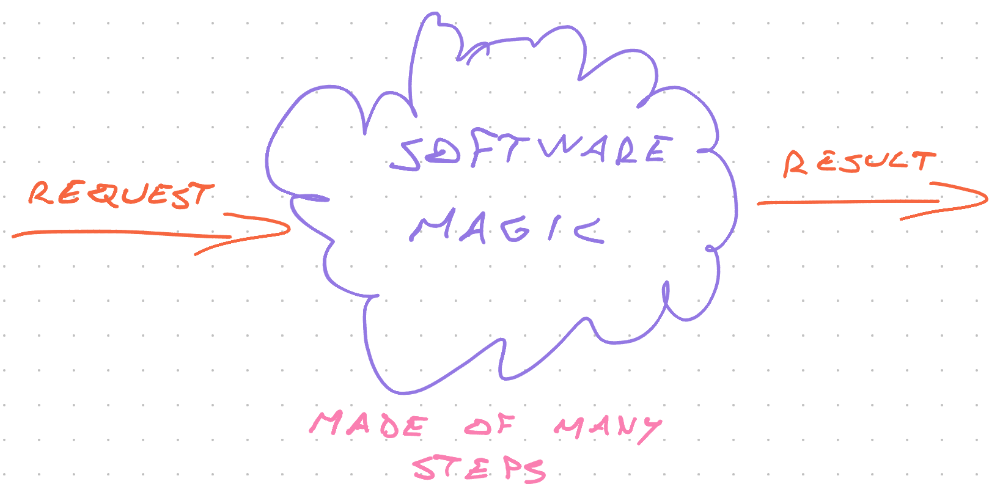

export const title = "Serverless cost optimization"

export const description =
  "Serverless cost optimization is about flow. Improving the performance of your system as a whole."

export const image = "/chapter_headers/serverless-cost-optimization.png"

# Serverless cost optimization

Among serverless's big innovations is metered pricing. Sometimes known as the ability to "scale to zero". Pay what you use and no more.

You want to use the fewest resources you can. That means you need to:

1. [Improve performance of individual components](/serverless-performance)
2. Optimize flow through the system

Requests stuck in the system, queues bulging with data, retrying mistakes, all that costs money. And it adds up fast.

## What is flow

> Flow is the performance of your system as a whole.

Imagine you're on a hike with friends. You're going to an old fashioned lodge that serves a stew you've been craving for days.

They don't rush perfection. Every day the stew runs out early.

You're hiking with a mixed group of folk. A few are fast, a few are slow, most are average. Nobody eats until you're all at the lodge together. That would be rude.

What happens?

Same thing that always happens on these hikes. The fast folk rush ahead, everyone else tries to catch up. After a few twists and turns of the trail the fast folk stop and wait.

The rest of the group catches up, panting and sweating. They need a break after exerting themselves to catch up. Grab some water, catch their breath.

Everyone waits. When the most out of shape is ready to continue, the story repeats.

In fits and starts you make it to the lodge by mid afternoon. Your stew is gone.

## Theory of constraints

You could've made it in time: Let the slowest person dictate everyone's pace.

Slowest person in front, you end up stopping less. They don't get tired, don't get discouraged, and you keep moving. Smoothly.

Make their hike easier and everyone goes faster! Take their backpack, carry their water.

This is the core lesson of Goldratt's [Theory of Constraints](https://en.wikipedia.org/wiki/Theory_of_constraints) – you cannot move faster than your bottleneck. But you can speed up the bottleneck.

The theory of constraints is a management way of thinking about systems popular in DevOps. Distributed software systems are similar to factories.

Requests come in, magic happens, results go out. The magic is made of inter-dependent and parallel steps.

, for a parallel from computer science, you can look at [Amdahl's law](https://en.wikipedia.org/wiki/Amdahl%27s_law).

### Amdahl's law

### WIP is the killer

theory of constraints and how to think about managing your stuff

WIP is the productivity killer

flow through the whole system is what matters

mention amdahl's law

## Queuing theory

describe queuing theory in its basics

mention little's law and why it's important

