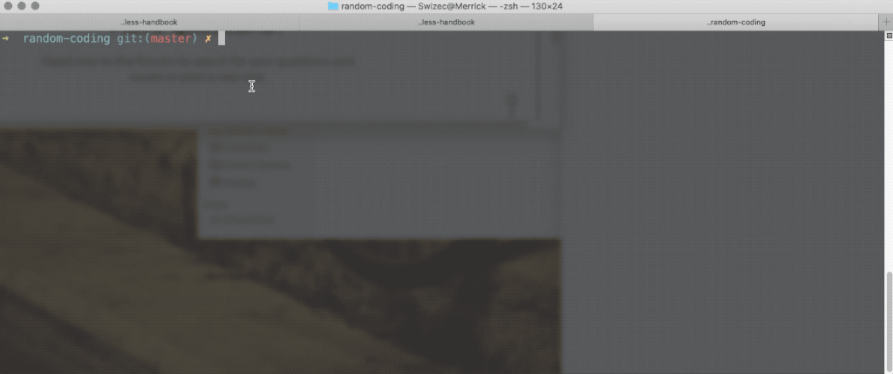
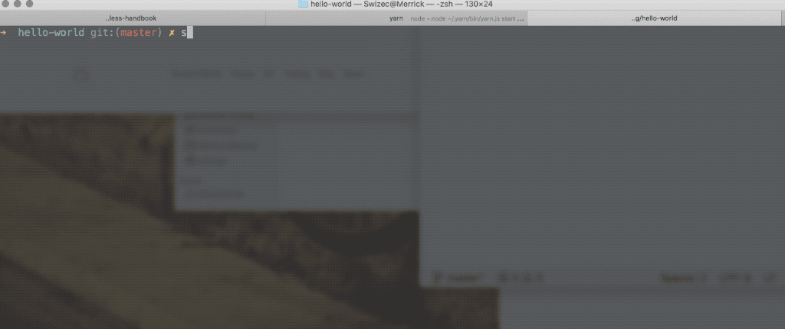
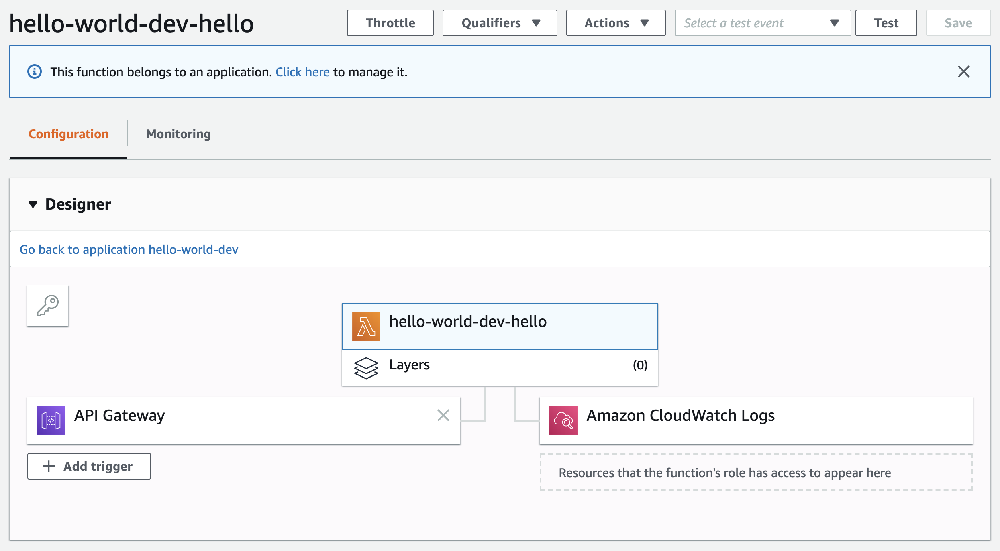

export const title = "Create a good serverless developer experience"

export const description = "How to setup your project for a pleasant serverless developer experience"

export const image = "/chapter_headers/good-dx.png"

# Create a good serverless developer experience


What makes a good developer experience?

Answers on twitter were all over the place and shared a common theme:

> Good developer experience is when tools make your job easier, get out of the way, and let you focus on *your* code

https://twitter.com/Swizec/status/1195742841877610496

How do you setup a serverless project for good DX?

It comes down to 3 features:

1. Infrastructure-as-code
2. Fast deploys
3. Tooling for common tasks

## Infrastructure-as-code

https://twitter.com/muditameta/status/1195783892512444417

As I mentioned in the [Getting Started](https://serverlesshandbook.dev/getting-started#setup-for-serverless-work) chapter, I like to use the open source [Serverless Framework](https://en.wikipedia.org/wiki/Serverless_Framework) with AWS. When using Netlify and Vercel you don't need Serverless because config-as-code is baked into their philosophies.

You write a configuration file, add it to version control, and that's your infrastructure. *Nothing* happens outside that configuration file.

This means that:

1. **Your deploys are replicable**. Run deploy, get the same result every time. The same functions, the same queues, the same caching servers, everything.
2. **Same infrastructure in test as in prod** Subtle differences between test environments and production are a waste of your time. Infrastructure-as-code fixes that. Big part of why Docker got popular.
3. **Share infrastructure between the team**. Ever had to ask a team member what environment variable they used for a thing? I have. After 2 hours of digging into the problem to realize it's a configuration issue.
4. **Infrastructure that always fits your feature branch** A common problem on a bigger team are features with different infrastructures. Say you added a new queue or cloud function. Instead of setting it up every time you test, you can use infra-as-code to do it for you.
5. **Spend times in the tools you like, not confusing web UI** We're engineers, we like building things. Not clicking around a web UI doing repetitive tasks that take 20 minutes.

## Fast deploys

https://twitter.com/CodingDive/status/1195776781921464321

The shorter your feedback cycle, the faster you can work. 

On the frontend we have local dev servers and hot reloading. You get to see the results of your change almost as fast as you write them.

On the backend things are trickier.

You make a change ... now what? If you have unit tests, they show you some of the picture. The specific scenarios you thought to test, the methods you're exercising, the particular inputs you thought of.

All great.


But unit tests can't tell you *your system* works. That's where most bugs come from – systems complexity.

You can simulate the environment and run your tests. That works to an extent, but it's never quite perfect.

Your best bet is to make deploying to a staging, QA, or prod environment so fast that you can use it during development. With serverless, that becomes possible.

You could even set it up so pushing to GitHub automatically deploys every branch. Netlify and Zeit both encourage this model.

### How fast deploys work

Here's how the flow works:

0. Hit deploy
1. **Compile your code locally** on your fast developer machine. Since your code is small, it compiles in seconds.
2. **Compile your infrastructure** the serverless framework compiles your infrastructure into a config file for the target platform. With AWS that's [SAM](https://aws.amazon.com/serverless/sam/).
3. **Upload your bundle** this is often the slowest part.
4. **Infrastructure sets itself up** using your config the platform sets itself up. Servers show up, queues go up, stuff like that. Takes a few seconds 
5. **You're ready to go**

<div id="lock" />

Longest deploy times I've seen on production-sized backends are in the 2 minute range. But that's a system with a configuration file in the hundreds of lines.

Most often it's under a minute.

Compared to a traditional Heroku deploy that takes around 20 minutes at my day job.

## Tooling for common tasks

I like to use my project's `package.json` as a collection of scripts for common tasks. Using `yarn` makes them easy to run, `npm run` works too.

The most common is `yarn deploy`

```
package.json

"scripts": {
	"build": "tsc build",
	"deploy": "npm run build && sls deploy"
}
```

With those 2 lines you can deploy from any branch without worry that you'll forget to build your project first. The `build` script runs a typescript build – you should use it for other builds, too – and `sls deploy` runs a serverless deploy process.

This gets trickier when you use multiple environments. We'll talk about that in the chapter on prod, QA, and staging environments.

Other helpful tools I've set up for my bigger projects include:

- `yarn psql` to connect to my remote database
- `reset-env` to reset a remote database for testing
- `test-X` to run various types of tests against the server environment
- `add-engineer` to add a new engineer-specific environment so everyone can test on their own

Any time you find yourself running the same sequence of commands for a task, you should consider adding them as a script to your package.json. Give others that same super power :)

# How this works in practice

In the next few minutes you're going to build your first serverless backend. A small service that says Hello 👋

We're using open source technologies and deploying on AWS Lambda. You can learn about other providers in the [Serverless Flavors](/serverless-flavors) chapter.

You'll need a computer set up for JavaScript development: Have nodejs installed, a code editor, and a terminal.

## Setup for serverless work

With the serverless framework we configure our servers using YAML files. The framework figures out the rest.

Install it globally:

```sh
npm install -g serverless
```

You'll need AWS credentials as well. 

I recommend following [Serverless's guide on AWS setup](https://serverless.com/framework/docs/providers/aws/guide/credentials/). It walks you through the necessary steps on your Amazon account and some terminal commands you'll have to run.

## Create a tiny project

There are no special initializers for serverless projects yet. So to start a serverless project, you create a directory and add a configuration file.



```sh
mkdir hello-world
cd hello-world
touch serverless.yml
touch handler.js
```

You have a project with 2 files:

- `serverless.yml` for configuration
- `handler.js` for server code

In future chapters we'll write backends using TypeScript, but one thing at a time :)

## Configure your first server

Configuration for your server goes in `serverless.yml`. We're telling the Serverless framework that we want to use AWS, run nodejs, and that this is a dev project.

Then we'll tell it where to find our code.

```yaml
# serverless.yml

service: hello-world

provider:
    name: aws
    runtime: nodejs10.x
    stage: dev
```

Our service is called `hello-world` and there's some details about our provider. The `stage` helps us tell the difference between development, QA, and production deployments. More on that in the [Dev, QA, and prod](/dev-qa-prod) chapter.

Now let's tell our server how to run some code.

```yaml
# serverless.yml

service: hello-world

provider:
    name: aws
    runtime: nodejs10.x
    stage: dev

functions:
    hello:
        handler: ./handler.hello
        events:
            - http:
	              path: hello
	              method: GET
	              cors: true
```

We started a `functions` section. 

Each entry becomes its own tiny server – a serverless lambda. Together, they're the `hello-world` service.

The `hello` lambda calls an exported `hello` function inside our `handler.js` file whenever a GET request hits `/hello`.

All that from just these few lines of code 👌

PS: enabling [CORS](https://en.wikipedia.org/wiki/Cross-origin_resource_sharing) lets you call this function from other websites. Like your frontend app.

## Write a backend function

Backend functions in a serverless environment look a lot like the JavaScript functions you're used to. Accept some arguments, return a response.

Add a hello function to `handler.js`

```javascript
// handler.js

exports.hello = async (event) => {
    return {
        statusCode: 200,
        body: "Hello 👋"
    }
}
```

It's an async function that accepts a triggering event and returns a response. A success status with a `Hello 👋` body.

That's it. You just wrote some backend code.

## Deploy your first serverless backend

To deploy, we run `serverless deploy`.



And your server is up.

You get a URL for your lambda and some debugging output so you know what's going on. My URL is `https://z7pc0lqnw9.execute-api.us-east-1.amazonaws.com/dev/hello`, if you open it in your browser, it's gonna say `Hello 👋`

I'll keep it up because I'm not paying for it unless somebody clicks. And even when they do, current AWS pricing gives me 1,000,000 clicks per month for free 😛

## What you got

Behind the scenes, the Serverless framework talked to AWS and configured many things.



- **API Gateway** to proxy requests from the internet to your function
- **Lambda** to run your code. This is a tiny container that wakes up when called.
- **CloudWatch logs** to collect logs from your code. Helps with debugging.

All those get configured for you. No UI to click through, no config to forget about next time, nothing your friends have to set up to deploy the same code.


Pretty good, right?

Next chapter, we're going to talk about designing your serverless architecture.