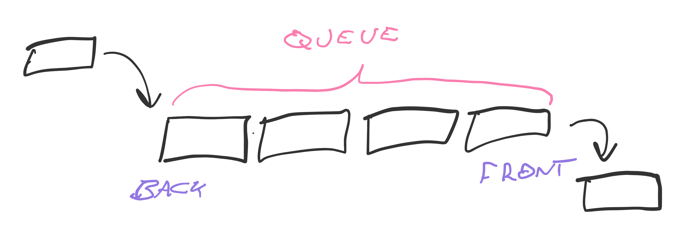
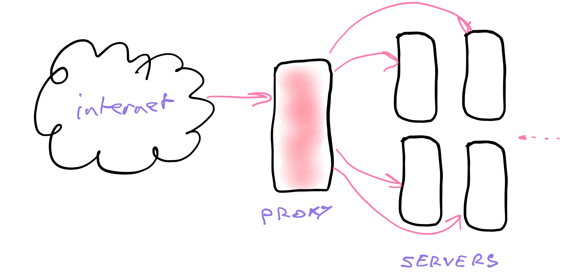
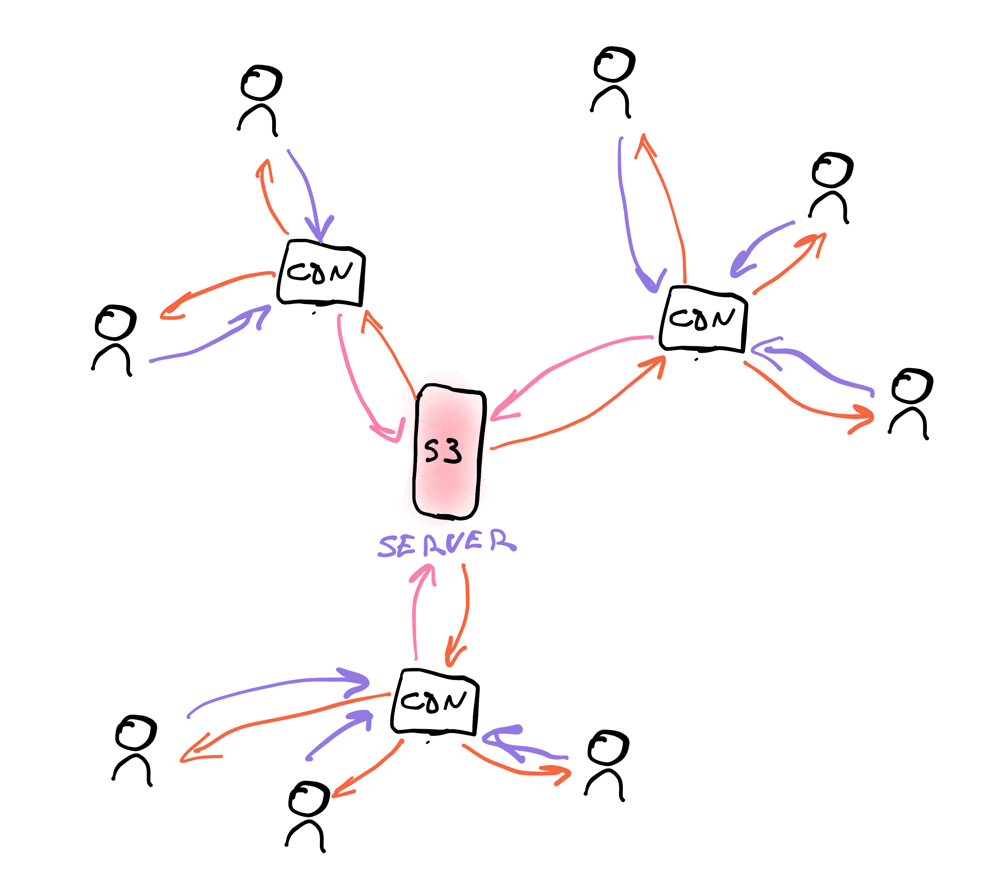

# Elements of serverless – lambdas, queues, gateways, and more


We mentioned lambdas, queues, and other elements of serverless in previous chapters – [Architecture Principles](/serverless-architecture-principles) and [Serverless Flavors](/serverless-flavors) – but what *are* they? 

Let me explain.

## Lambda – a cloud function

"Lambda" comes from [lambda calculus](https://en.wikipedia.org/wiki/Lambda_calculus), a mathematical definition of functional programming Alonzo Church introduced in the 1930s. It is an alternative to Turing's [turing machines](https://en.wikipedia.org/wiki/Turing_machine) for describing a system that can [solve any solvable problem](https://en.wikipedia.org/wiki/Church%E2%80%93Turing_thesis). Turing machines describe iterative step-by-step programming, lambda calculus describes functions-calling-functions functional programming.

Both are equal in power.

AWS named their cloud functions AWS Lambda. As the platform grew in popularity, the word "lambda" morphed into a generic term for cloud functions and the core building block of serverless computing.

**A lambda is a function.** In this context, a function running as its own tiny server triggered by an event.

Here's a lambda function that returns `"Hello world"` in response to an HTTP event.

```typescript
// src/handler.ts

import { APIGatewayEvent } from "aws-lambda";

export const handler = async (event: APIGatewayEvent) => {
	return {
		statusCode: 200
		body: "Hello world"
	}
}
```

The TypeScript file exports a function called `handler`. The function accepts an event and returns a response. The AWS Lambda machinery handles the rest.

Because this is a user-facing API method, it accepts an AWS API Gateway event and returns an HTTP style response. Status code and body.

Other providers and services have different events and expect different responses, but **a lambda always follows this pattern 👉 function with an event and a return value.**

### Considerations with lambda functions

Your functions should follow functional programming principles:

- **idempotent** – multiple calls with the same inputs produce the same result
- **pure** – rely on the arguments you're given and nothing else. Your environment does not persist, data in local memory might vanish.
- **light on side-effects** – you need side-effects to make changes like writing to a database. Make sure those come in the form of calling other functions and services. *State inside your lambda does not persist*
- **do one thing and one thing only** – small functions focused on one task are easiest to understand and combine

Small functions work together to produce extraordinary results. Like this example of [combining Twilio and AWS Lambda to answer the door](https://swizec.com/blog/how-i-answer-the-door-with-aws-lambda-and-twilio/swizec/9255).

### Creating lambdas

In the open source Serverless Framework, you define lambda functions with `serverless.yml` like this:

```yaml
functions:
    helloworld:
        handler: dist/helloworld.handler
        events:
            - http:
                  path: helloworld
                  method: GET
                  cors: true
```

Define a `helloworld` function and say it maps to the `handler` method exported from `dist/helloworld`. We're using a build step for TypeScript the code is in `src/`, but we run it from `dist/`.

`events` lists triggers that run this function. An HTTP GET request on the path `/helloworld` in this case.

Other typical triggers include Queues, S3 changes, CloudWatch events, and DynamoDB listeners. At least on AWS.

## Queue

Queue is short for [message queue](https://en.wikipedia.org/wiki/Message_queue) – a service built on top of [queue, the data structure](https://en.wikipedia.org/wiki/Queue_(abstract_data_type)). Software engineers aren't that inventive with names and like to overload words 🤷‍♂️

You can think of the queue data structure as a list of items.



`enqueing` adds items to the back of a queue, `dequeing` takes them out the front. Items in the middle wait their turn. Like a lunch-time burrito queue. First come first serve, FIFO for short (first in first out).

<div id="lock" />

**A messaging queue takes this data structure and scales it into a service.** 

Different implementations exist and they all share these core properties:

- **persistent storage** – queues have to be reliable and store messages in a database. Most queues prioritize speed and use in-memory storage like Redis.
- **a worker process** – once you have messages, you need to process them. A process periodically checks, if there's something new [(polling)](https://en.wikipedia.org/wiki/Polling_(computer_science)). Another approach is to trigger this check every time a message arrives.
- **a trigger API** – when the queue sees a new message, it runs your code. In serverless that means running your lambda, in traditional environments it's another worker process.
- **a retry/error policy** – queues help you deal with errors. When you fail to process a message, it goes back on the queue and gets retried later.

Many modern queues add time to the mix. You can *schedule* messages for later. 2 seconds, 2 minutes, 2 days, ... Some queues limit how long messages can stick around.

### Time helps with errors

Server processes can [fail for any reason at any time](/architecture-principles). For temporary errors a queue can use [exponential backoff](https://en.wikipedia.org/wiki/Exponential_backoff) when retrying. Giving your system more and more time to recover from issues.

Try to process a message. It fails. Try after 1 second. Fails. Retry in 2 seconds. Fail. 4 seconds ...

I've seen corrupt messages, known as poison pills, backing off days into the future. We about handling unprocessable messages in the [Robust Backend Design](/robust-backend-design) chapter.

### Defining a queue

AWS SimpleQueueService is a great queue service for the AWS serverless ecosystem. More powerful alternatives exist, but require more setup, more upkeep, and have features you might not need.

> Always use the simplest and smallest service that solves your problem until you know *why* you need more ✌️

Using the serverless framework, you define an SQS queue in the `resources` section like this:

```yaml
resources:
    Resources:
        MyQueue:
            Type: "AWS::SQS::Queue"
            Properties:
                QueueName: "MyQueue-${self:provider.stage}"
```

A resource named `MyQueue` of the SQS Queue type with a queue name of `MyQueue-{stage}`. Adding the stage to your queue name allows different logical environments without collisions. More on that in [the Dev, QA, and Prod chapter](/dev-qa-prod)

Make sure you use correct capitalization. The second `Resources` must be capitalized, so do `Type`, `Properties`, and `QueueName`. 

Capitalization matters because you're dropping a layer below Serverless and writing AWS's native Serverless Application Model (SAM) configuration. It's what your config compiles to before deploying.

### Processing a queue

You need a lambda to process messages on `MyQueue`.

```yaml
functions:
    myQueueProcess:
        handler: dist/lambdas/myQueue.handler
        events:
            - sqs:
                  arn:
                      Fn::GetAtt:
                          - MyQueue
                          - Arn
                  batchSize: 1
```

A lambda triggered each time `MyQueue` has a new message to process. With a `batchSize` of 1, each message runs its own lambda – a good practice for initial implementations. More about batch sizes in the [Lambda Workflows](/lambda-workflows) and [Robust Backend Design](/robust-backend-design) chapters.

The strange yaml syntax reads as: *an SQS event fired by a queue with the ARN identifier of getAttribute(Arn) from MyQueue*. Amazon Resource Names, ARN, are unique identifiers for each resource in your AWS account.

The `myQueue.handler` lambda would look like this:

```typescript
import { SQSEvent, SQSRecord } from "aws-lambda";

export const handler = async (event: SQSEvent) => {
    // N depends on batchSize setting
    const messages: string[] = event.Records.map(
        (record: SQSRecord) => record.body
    );

    // do something with each message
    // throw Error() on fail

    return true;
};
```

An async function that accepts an `SQSEvent`, which contains multiple messages depending on `batchSize`. Never assume the total number because that setting might change.

Extract messages into an array of strings and process with a loop. Throw an error when something goes wrong so SQS can retry. Return true on success.

### SNS

A useful alternative to SQS is the Simple Notification Service – SNS. Similar behavior, except you can't store messages on the queue.

With SNS each message sends *once*. If you don't catch it, it's gone.

But unlike SQS, each message can trigger multiple services.

## API Gateway

You might not realize this, but servers don't talk directly to the internet.


Most servers are protected by a [reverse proxy](https://en.wikipedia.org/wiki/Reverse_proxy) – a server that specializes in taking raw internet requests and routes them to application servers.



Requests come from the wild internet into the proxy. The proxy then decides:

- is this a valid request?
- will this request break the system?
- which type of server can handle this?
- which instance of that server should do it?

Validating requests can involve checking for denial of service attacks, verifying permissions, firewall protection, and even A/B testing.

Once verified the request goes to an instance of your application server. This is where [horizontal scaling](https://en.wikipedia.org/wiki/Scalability#HORIZONTAL-SCALING) comes into play.

Amazon calls their reverse proxy service API Gateway. 

Other providers might have different names and they all perform the same function: Take request from the internet and pass it on to your lambda.

## Static file storage – S3

The serverless world is ephemeral which means you can't save files just anywhere.

Adding large files to your code makes running new containers slow. And you can't save locally because your server disappears after each request.

Static file storage services solve that problem. 

AWS S3 is the most common. Other hosting services often act as an S3 abstraction. Pundits have called S3 the 8th wonder of the world.

https://twitter.com/QuinnyPig/status/1220805676168970246

You can think of S3 as a hard drive with an API. Read and write files, get their URL, etc.

Each file gets a URL backed by a server optimized for static files. No code, no dynamic changes. A raw file flying through HTTP.

## Static file server – CDN



CDNs – [content delivery networks](https://en.wikipedia.org/wiki/Content_delivery_network) – are the next step in static file storage. They're like a distributed caching system.

Where S3 serves files from a central location, a CDN serves those same files from as close to the end user as possible. Speeding up your website by reducing latency.

Configuration on your end goes like this:

1. Point the CDN to your static file URL
2. The CDN gives you a new URL
3. Use *that* URL in your client-side code

You can automate this part with build tools. Netlify and Vercel both handle it for you.

Now when a browser requests a file, the URL resolves to the physically nearest server. Request goes to that server and if the file is there, it's served. If there's no file, the CDN goes to your original source, caches the file, and *then* sends it back to the user.

And now your JavaScript, HTML, images, fonts, and CSS are fast to load anywhere in the world. 👌

## Logging

Logging is one of the hardest problems in a distributed multi-service world. You can't print to the console or write to a local file.

You can't see the console and files vanish after every request.

What do you do?

You use a logging service to send logs to a central location.

Implementing a logging service yourself is tricky (I've done it, do not recommend) and the AWS ecosystem has you covered with CloudWatch. The UI tools for reading logs lack filtering and graphing features you'd want as a power user, but it's a great start.

Anything you `console.log` is collected in CloudWatch alongside default logs.

# Those are the important elements

Now you know the most important elements of your serverless ecosystem:

- lambdas for doing things
- queues for communicating
- gateways for handling requests
- S3 for static files
- CDN for serving static files
- logging to keep track

There's a bunch more to discover, but that's the core. Next chapter we look at using these to build a robust system.
