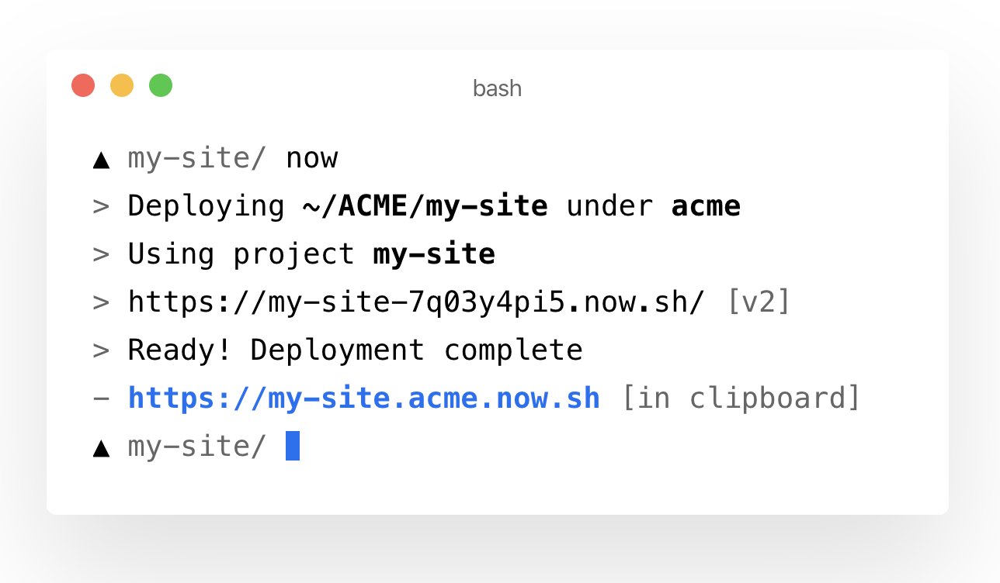

export const title = "AWS, Azure, Zeit, Netlify, or Firebase?"

export const description  = "How do you choose among the many providers of serverless tech?"

export const image = "/chapter_headers/serverless-flavors.png"

# AWS, Azure, Zeit, Netlify, or Firebase?

You've read the [getting started](/getting-started) of serverless, you know the [pros and cons](/serverless-pros-cons), and you've decided serverless is the right fit for your next project.

Now what?

There's a bunch of providers with different features, different pricing, different DX, different focus ... how do you choose?

Having tried many of those providers myself (AWS, Netlify, Zeit, Firebase), here's how I think about it 👇

## AWS

AWS is the serverless workhorse. With a seemingly infinite array of services it's been leading the charge with everything from function-as-a-service to hosted blockchain and machine learning products.

Other providers often use AWS behind the scenes. Heroku runs their dynos on EC2 instances, Netlify and Zeit use S3 for static files, etc. It's hard to know exact details from the outside, but I doubt they run their own data centers. At least not for everything.

Did you know AWS was so big it's [more than half of Amazon's profit](https://www.itproportal.com/news/aws-now-makes-up-over-half-of-all-amazon-revenue/)?

With over 165 services it's impossible to try or even know all of AWS. Here's a few I've found useful:

- **EC2** – old school cloud. You get a virtual computer, set it up, and you're in control. Runs forever unless you make it stop.
- **S3** – the most popular solution for static files. Upload a file, get a URL, file stays there forever. Often used for image and video assets, can't run server code or host a website.
- **CloudFront** – a [CDN](https://en.wikipedia.org/wiki/Content_delivery_network) that integrates well with S3. Point to static files via CloudFront and it serves files from the physically nearest server to your users. Works like a read-through cache, makes your apps faster.
- **IAM** – identity and account management. AWS forces you to use this one to manage permissions. It's super secure, tedious to set up, and as far as I can tell everyone hates it. Until it saves their butts.
- **AWS Secrets Manager** – a secure way to use secrets like API keys in your serverless apps. Not in code, not in environment variables, but a secure storage that's encrypted at rest. Enables you to rotate values for everyone.
- **Lambda** – the poster child for serverless. One of the first to popularize function-as-a-service architectures. Write your function code, Lambda handles the rest.
- **SQS** – simple queue service is ... a simple way to implement queues. Best used for async communication between services. Stores and retries messages if necessary.
- **SNS** – simple notification service. Similar to SQS but designed for broadcasting. Many listeners can read each message in parallel and every message is delivered just once.
- **DynamoDB** – a hosted JSON document storage. One of the quickest ways I've found to persist data in a serverless application. Save a JSON blob, read it later. Not recommended for very relational data models.
- **RDS** – relational database service. Set up a Postgres or MySQL (and some others) database in the cloud and AWS handles the rest. Better fit for traditional data with lots of relations. 
- **CloudWatch** – a logging system. Every service in AWS connects to CloudWatch to dump logs and other debugging data. You can use it to fire lambdas on a schedule as well.

AWS services add up fast. Every tool does one job and does it well. No single tool does *your* whole job.

### When to choose AWS

I like to use AWS when I need lots of control over both the developer experience and how everything fits together. 

For example I'd use AWS when my project involves data pipelines, coordinating between users, and other complex backend logic. You know it's backend logic because it impacts multiple users using different devices.

### When not to choose AWS

Where AWS becomes overkill are most JAMstack apps. You've got a mostly static site with lots of frontend logic.

Hosting those on AWS is difficult, too. Best use Netlify or Zeit I think.

## Azure

To be honest, I don't know much about Azure. I know it exists, I know it's similar to AWS.

Best I can tell Azure's biggest draw is that it's Microsoft instead of Amazon. Lots of enterprises use it, but it hasn't captured the imagination of indie hackers.

Not sure why that is. 

## Firebase

Firebase is Google's answer to AWS. Sort of.

You can think of Firebase as a done-for-you backend for web and mobile apps. You set up an account, configure next to nothing, and you're ready to go.

Right now there are 18 firebase services ranging from analytics to database and even machine learning. I've tried their database solution before and it works great.

I know this is less extensive than the AWS section and that's sort of the point. Firebase doesn't want you to have to think about any of this.

### When to choose Firebase

You get everything out of the box with Firebase. There's no setup, no configuration, nothing.

You'll have to change how you write some of your frontend code so it hooks up with Firebase and ... that's about it. 

Great for small demos and for developers who don't want to think about the backend at all.

### When not to choose Firebase

Like with other Just Works Magic providers, you're in trouble as soon as you step off the beaten path. Or when you have a special requirement they didn't predict.

When that happens your choice is to either change your app or rebuild everything from scratch.

## Netlify

Netlify is wonderful. They invented everyone's favorite [JAMstack](https://en.wikipedia.org/wiki/Netlify#JAMstack) buzzword. 

At first just a static site host for JavaScript-heavy applications they now offer some backend capabilities too. 

I've used Netlify for easy static hosting, but haven't tried their function-as-a-service features yet. Twitter rumor has it they're pretty solid and easier to use than AWS.

Among Netlify's biggest draws are:

- a great web UI to manage your projects
- git integration for automated deploys
- custom URLs for every branch
- automatic CDN and SSL setup for your site
- app builds run on their servers
- you can run their infrastructure locally
- great support for teams

### When to choose Netlify

From what I can tell, Netlify is the best funded startup in this arena. That can be an important factor.

They've been around long enough to rely on and are still young enough that you'll get a proper response, if you have issues. I find that to be a great balance :)

If you like a git- and UI- first mentality for your deploys, Netlify is great.

### When not to choose Netlify

Netlify is almost always a great choice for your web app. Not sure I'd use them for backend code because their FaaS is still new. 

If you like interacting with your deploys via the command line, I've found Netlify to not be the best option. Their configuration files are also written in TOML, which is less popular than YAML and will take some getting used to.

## Zeit

Zeit is wonderful. Netlify's direct competitor from what I can tell and created by some really wonderful folks.

You might remember [socket.io](https://en.wikipedia.org/wiki/Socket.IO), if you've been around long enough. Same guy :)

Zeit's focus, however, is different than Netlify's. 

Where Netlify makes static deploys painless to configure and deploy via git and their UI, Zeit focuses on making *any* app painless to deploy via their CLI. Zeit is command-line first, git and UI second.

My favorite use-case for Zeit is buying domains from the command line and deploying static sites. 

Haven't used their backend support yet. They let you run Express apps which seems useful and nowadays there's even FaaS support. 

Among Zeit's biggest draws are:

- superb command line interface
- configureless deploys for most projects
- git integration for automated deploys
- custom URLs for every deploy
- automatic CDN and SSL setup for your site
- app builds run on their servers
- great support for teams

### When to choose Zeit

Zeit is almost always a great choice for your web app. 

Honestly it's a toss up between Netlify and Zeit right now. They're both playing catch up. When one releases a new feature, the other gets it a few months later.

I like Zeit's great command line interface and the fact I can run `now` in any project and it shows up on the internet. Usually no clicking or config needed.

### When not to choose Zeit

According to public data Zeit has less funding than Netlify and they spend less time inside the community itself. Fewer dev evangelists and smaller marketing budget I'd guess.

That means it's easier to get attention from the core team, even the founders. This is great, but can mean that the smaller team will take longer to resolve any really hairy issues you run into.

If you *prefer* interacting with UI and writing config files, then Zeit's focus might not be for you :)

## So ... what to choose?

My preference is to put the frontend on Netlify or Zeit and the backend on AWS's serverless ecosystem.

This gives me easy deploys on both ends and a good balance between control and simplicity.
