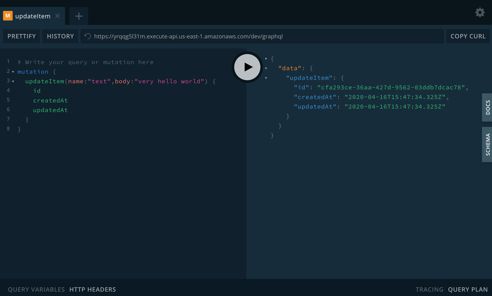

export const title = "Using GraphQL"

export const description = "Learn about GraphQL and how to use it with serverless"

export const image = '/chapter_headers/serverless-graphql.png'

# Using GraphQL


Say you're building an app. It needs data from a server. What do you do?

You make a `fetch()` request.

```javascript
fetch('https://swapi.co/api/people/1/')
	.then(res => res.json())
	.then(console.log)
```

And you get eeeevery piece of info about Luke Skywalker.

```json
{
	"name": "Luke Skywalker",
	"height": "172",
	"mass": "77",
	"hair_color": "blond",
	"skin_color": "fair",
	"eye_color": "blue",
	"birth_year": "19BBY",
	"gender": "male",
	"homeworld": "https://swapi.co/api/planets/1/",
	"films": [
		"https://swapi.co/api/films/2/",
		"https://swapi.co/api/films/6/",
		"https://swapi.co/api/films/3/",
		"https://swapi.co/api/films/1/",
		"https://swapi.co/api/films/7/"
	],
	"species": [
		"https://swapi.co/api/species/1/"
	],
	"vehicles": [
		"https://swapi.co/api/vehicles/14/",
		"https://swapi.co/api/vehicles/30/"
	],
	"starships": [
		"https://swapi.co/api/starships/12/",
		"https://swapi.co/api/starships/22/"
	],
	"created": "2014-12-09T13:50:51.644000Z",
	"edited": "2014-12-20T21:17:56.891000Z",
	"url": "https://swapi.co/api/people/1/"
}
```

Well that's annoying ... all you wanted was his name and hair color. Why's the API sending you all this crap? 🤦‍♂️

And what's this about Luke's species being `1`? What the heck is `1`?

Okay, another fetch request.

```javascript
fetch('https://swapi.co/api/species/1/')
	.then(res => res.json())
	.then(console.log)
```

You get a bunch of data about humans. Great.

```json
{
	"name": "Human",
	"classification": "mammal",
	"designation": "sentient",
	"average_height": "180",
	"skin_colors": "caucasian, black, asian, hispanic",
	"hair_colors": "blonde, brown, black, red",
	"eye_colors": "brown, blue, green, hazel, grey, amber",
	"average_lifespan": "120",
	"homeworld": "https://swapi.co/api/planets/9/",
	"language": "Galactic Basic",
	"people": [
		"https://swapi.co/api/people/1/",
		"https://swapi.co/api/people/4/",
		"https://swapi.co/api/people/5/",
		"https://swapi.co/api/people/6/",
		"https://swapi.co/api/people/7/",
		"https://swapi.co/api/people/9/",
		"https://swapi.co/api/people/10/",
		"https://swapi.co/api/people/11/",
		"https://swapi.co/api/people/12/",
		"https://swapi.co/api/people/14/",
		"https://swapi.co/api/people/18/",
		"https://swapi.co/api/people/19/",
		"https://swapi.co/api/people/21/",
		"https://swapi.co/api/people/22/",
		"https://swapi.co/api/people/25/",
		"https://swapi.co/api/people/26/",
		"https://swapi.co/api/people/28/",
		"https://swapi.co/api/people/29/",
		"https://swapi.co/api/people/32/",
		"https://swapi.co/api/people/34/",
		"https://swapi.co/api/people/43/",
		"https://swapi.co/api/people/51/",
		"https://swapi.co/api/people/60/",
		"https://swapi.co/api/people/61/",
		"https://swapi.co/api/people/62/",
		"https://swapi.co/api/people/66/",
		"https://swapi.co/api/people/67/",
		"https://swapi.co/api/people/68/",
		"https://swapi.co/api/people/69/",
		"https://swapi.co/api/people/74/",
		"https://swapi.co/api/people/81/",
		"https://swapi.co/api/people/84/",
		"https://swapi.co/api/people/85/",
		"https://swapi.co/api/people/86/",
		"https://swapi.co/api/people/35/"
	],
	"films": [
		"https://swapi.co/api/films/2/",
		"https://swapi.co/api/films/7/",
		"https://swapi.co/api/films/5/",
		"https://swapi.co/api/films/4/",
		"https://swapi.co/api/films/6/",
		"https://swapi.co/api/films/3/",
		"https://swapi.co/api/films/1/"
	],
	"created": "2014-12-10T13:52:11.567000Z",
	"edited": "2015-04-17T06:59:55.850671Z",
	"url": "https://swapi.co/api/species/1/"
}
```

That's a lot of data just to get the word `"Human"` out of the [Star Wars API](https://swapi.co/) ...


What about all of Luke's starships? There's just 2 and yet that's 2 more API requests ...

```javascript
fetch("https://swapi.co/api/starships/12/")
	.then(res => res.json())
	.then(console.log)
	
fetch("https://swapi.co/api/starships/22/")
	.then(res => res.json())
	.then(console.log)
```

I don't even wanna know how much data those dump out ...

You've just made **4 API requests** and transferred a shitload of data to find out that Luke Skywalker is human, has blond hair, and flies an X-Wing and an Imperial Shuttle.

And guess what, you didn't cache anything. How often do you think this data changes? Once a year? Twice?

🤦‍♂️

## GraphQL to the rescue

Here's what the same process looks like with GraphQL.

```graphql
query luke {
  Person(name: "Luke Skywalker") {
    name
    hairColor
    species {
      name
    }
    starships {
      name
    }
  }
}
```

And the API returns what you wanted with a single request.

```json
{
  "data": {
    "Person": {
      "name": "Luke Skywalker",
      "hairColor": [
        "BLONDE"
      ],
      "species": [
        {
          "name": "Human"
        }
      ],
      "starships": [
        {
          "name": "X-wing"
        },
        {
          "name": "Imperial shuttle"
        }
      ]
    }
  }
}
```

Wait what 😲

An API mechanism that gives you total flexibility on the frontend, slashes API requests to almost nothing, *and doesn't transfer a bunch of data you don't need?*

That's amazing! 

You write a query, specify what you want, send to an endpoint, and GraphQL figures out the rest. Want different params? Just say so. Want multiple models? Got it. Wanna go deep? You can.

All without making any changes on the server. Within reason.

Many GraphQL libraries add caching so you don't make the same calls too often. Some even consolidate queries so that making 10 requests real fast gets wrapped into a single API call. 😲

I fell in love the moment it clicked.


You can [try it out on graph.cool's public playground](https://swapi.graph.cool/)

<div id="lock" />

## What *is* GraphQL

GraphQL is an open-source data query and manipulation language for APIs, and a runtime for fulfilling queries with existing data. [[1]](https://en.wikipedia.org/wiki/GraphQL)

Often touted as a replacement for REST, GraphQL is really a different approach to building an API. Better suited for common use-cases and with its own set of drawbacks.

Don't let the propaganda fool you 👉 you can and should use both REST and GraphQL. Most real world projects need both.

GraphQL's main benefit is its declarative nature.

On the client, you describe what you want using its shape and GraphQL figures out how to get it. On the server, you write resolver functions for specific sub-queries and GraphQL combines them into the full result.

So while REST queries can be declarative on the client, GraphQL is declarative on both ends. For reads *and* writes.

### GraphQL queries

GraphQL queries fetch data. They follow this pattern:

```graphql
query {
	what_you_want {
		its_property
	}
}
```

You nest fields – often representing database models – and their properties into queries to describe the data-shape you're looking for. You can go as deep as you want.

Write fields side-by-side to create the effect of executing multiple queries with a single API request.

```graphql
query {
	what_you_want {
		its_property
	}
	other_thing_you_want {
		its_property {
			property_of_property
		}
	}
}
```

This is where the power and flexibility come from.

With variables you can create dynamic queries and even construct complex filters to further limit the scope of your result.

```graphql
query queryName($filterProp: "value") {
	field(filterProp: $filterProp) {
		property1
		property3
	}
}
```

`$filterProp` defines a new variable that the `field()` lookup uses to filter results for those matching `"value"`. 

GraphQL comes with basic equality filters built-in and you're encouraged to add more abilities in your resolvers. Many projects choose to support sorting, greater-than, not-equals, etc.

### GraphQL mutations

GraphQL mutations are used to write data. They follow this pattern:

```graphql
mutation {
	what_youre_updating(argument: "value", argument2: "value 2") {
		prop_you_want_back
	}
}
```

Similar to a query with arguments, you specify what you're updating and pass-in the update arguments. What's available depends on how mutation resolvers are implemented on the server.

The mutation body specifies which properties you want returned. You can nest these as deep as you'd like.

Just like queries, you can specify multiple mutations side-by-side and use variables.

```
mutation mutationName($argument: "value") {
	what_youre_updating(argument: $argument) {
		prop_you_want_back
	}
	
	other_field(argument: $argument) {
		return_prop
	}
}
```

## GraphQL vs. REST, which to use when

The GraphQL vs. REST debate is a false dichotomy. 

People like to say GraphQL is *replacing* REST and that's simply not the case. GraphQL is *augmenting* REST.

Will GraphQL become the future default API layer? Yes, probably.

Should you rip out your existing REST API and rewrite everything for GraphQL? Please don't.

GraphQL doesn't care where data comes from. Relational database, NoSQL database, files, a REST API, another GraphQL API ... doesn't matter. If you can write a function to fetch data in response to a query, that's all you need.

In fact, [you can start using GraphQL *without* changing your existing server](https://swizec.com/blog/how-you-can-start-using-graphql-today-without-changing-the-backend/swizec/9350) with a GraphQL middle layer. Create a GraphQL server and make it talk to your REST API.


### So how do you choose between REST and GraphQL?

When building a typical CRUD – Create, Read, Update, Delete – API, I like to ask 6 questions:

1. Is this a new project? *Default to GraphQL*
2. Do I know in advance what clients are going to need? *REST is great*
3. Am I fetching small subsets of large data? *GraphQL*
4. Am I generating new values for each request? *REST*
5. Updating a few properties on an object? *GraphQL*
6. Submitting large payloads to be saved? *REST*

Use upserts to deal with Create *and* Update. Avoid deletes – update a `deleted` flag instead and use soft deletes.

### Should you expose your entire data model verbatim?

No.

Exposing your full data model is a common mistake in API design for both GraphQL and REST. 

Define a logical API using [domain driven design](https://en.wikipedia.org/wiki/Domain-driven_design) instead. How your backend stores data for max performance and good database design differs from how your consumers think about that data.

Exposing server internals like that is a leaky abstraction and might lead to performance and security issues. *And* it makes your API hard to use.

There's also the question of derived and computed properties with complex business logic. You don't want to re-implement those on the client using raw data from your database.

## How to create a serverless GraphQL server



There's many ways you can go about this. The most pleasant approach I've found is with [Apollo](https://www.apollographql.com/)'s [apollo-server-lambda](https://github.com/apollographql/apollo-server/tree/master/packages/apollo-server-lambda) package, specifically designed for this purpose.

To create a GraphQL lambda, you follow a 4 step process:

1. Add to your `serverless.yml` file
2. Initialize the Apollo server
3. Specify your schema
4. Add your resolvers

We created a [simple REST api](https://serverlesshandbook.dev/serverless-rest-api#build-a-simple-rest) in the previous chapter, let's recreate the same functionality with GraphQL. Full [code on GitHub](https://github.com/Swizec/serverless-handbook/tree/master/examples/serverless-graphql-example)

Apollo creates a GraphQL playground for us. You can try my implementation here:

<iframe
  src="https://yrqqg5l31m.execute-api.us-east-1.amazonaws.com/dev/graphql"
  style={{ width: "120%", border: 0, height: "600px" }}
></iframe>

Make sure to change the URL inside the playground to: `https://yrqqg5l31m.execute-api.us-east-1.amazonaws.com/dev/graphql`. Apollo always drops the `/dev/` part for some reason.

### serverless.yml

We define a new Lambda function in our `functions:` section.

```yaml
# serverless.yml

functions:
  graphql:
    handler: dist/graphql.handler
    events:
      - http:
          path: graphql
          method: GET
          cors: true
      - http:
          path: graphql
          method: POST
          cors: true
```

I like to use the `/graphql` endpoint for everything, but you could split the API into sections and use different lambdas for different areas.

Make sure to define both `GET` and `POST` endpoints. `GET` serves the Apollo playground and `POST` handles the queries and mutations.

And I recommend enabling CORS, so you can talk to the server from wherever you host your client.

### initialize Apollo server

Every Apollo server needs a schema, a resolvers object, and the initialized server. You can add more bells and whistles later. This is what you need to get started:

```typescript
// src/graphql.ts

import { ApolloServer, gql } from "apollo-server-lambda"

// this is where we define the shape of our API
const schema = gql``

// this is where the shape maps to functions
const resolvers = {
  Query: {},
  Mutation: {},
}

const server = new ApolloServer({ typeDefs: schema, resolvers })

export const handler = server.createHandler({
  cors: {
    origin: "*", // for security in production, lock this to your real endpoints
    credentials: true,
  },
})
```

This server won't run yet because the `schema` and `resolvers` are mismatched. Resolvers have fields that the schema does not.

But that's the basic shape.

We'll add type definitions to the schema and a resolver for each `Query` and `Mutation` we add.

### specify your schema

Schema defines the broad shape of your API. It specifies every type of object your server returns and all query and mutation definitions.

You get a type-safe API because GraphQL ensures objects follow this schema. Both when coming into the API and flying out.

To mimic our [CRUD API from before](https://serverlesshandbook.dev/serverless-rest-api#build-a-simple-rest), we use a schema like this:

```typescript
// src/graphql.ts

const schema = gql`
  type Item {
    id: String
    name: String
    body: String
    createdAt: String
    updatedAt: String
  }

  type Query {
    item(id: String!): Item
  }

  type Mutation {
    updateItem(id: String, name: String, body: String): Item
    deleteItem(id: String!): Item
  }
`
```

We used to let users store and retrieve arbitrary JSON blobs and we can't do that with GraphQL. So we define an `Item` type with an arbitrary `body` string. 

You can use that to store serialized JSON objects.

We also specify that each item will have an `id`, a `name`, and a couple timestamps managed by the server. Those help you with debugging later on.

Our one `item()` query lets us retrieve items and requires an `id` to work. That's the exclamation point after `String`.

Then we have a mutation for upserting items and a mutation for deleting. We'll implement hard deletes to keep parity with the CRUD implementation from the REST chapter.

### create your resolvers

We have 1 query and 2 mutations. That means we'll need 3 resolver functions.

We can mostly copy these from the [REST implementation](https://serverlesshandbook.dev/serverless-rest-api#build-a-simple-rest) as the only difference is how we get arguments.

I like to put queries in a `src/queries.ts` file and mutations in a `src/mutations.ts`. You can organize this by model as your implementation grows.

#### item()

The `item()` query is a basic fetch and looks like this:

```typescript
// src/queries.ts

import * as db from "simple-dynamodb"

function remapProps(item: any) {
  return {
    ...item,
    id: item.itemId,
    name: item.itemName,
  }
}

// fetch using item(id: String)
export const item = async (_: any, args: { id: string }) => {
  const item = await db.getItem({
    TableName: process.env.ITEM_TABLE!,
    Key: {
      itemId: args.id,
    },
  })

  return remapProps(item.Item)
}
```

We can ignore Apollo's first resolver argument for now. The second argument is where query and mutation arguments live.

Since `id` is a required param, you don't have to check for nulls. GraphQL will handle that before ever calling your resolver.

Means you can call `getItem` on DynamoDB, or run a SQL query for a relational database, and return the result. GraphQL handles the rest.

One niggle to note 👉 DynamoDB considers `name` and `id` reserved attributes. We remap them to `itemName` and `itemId` when saving and have to map them back to pretty GraphQL attributes when reading.

This is what I meant by *"You don't want to expose raw database details to your API"* :)

#### updateItem()

The `updateItem()` mutation is our most complex. 

It creates a new item when you don't provide an `id` and updates an existing item when you do. If the item isn't found, it throws an error.

And it keeps `createdAt` and `updatedAt` timestamps up to date.

```
// src/mutations.ts

type ItemArgs = {
  id: string
  name: string
  body: string
}

// upsert an item
// item(name, ...) or item(id, name, ...)
export const updateItem = async (_: any, args: ItemArgs) => {
  let itemId = args.id ? args.id : uuidv4()

  let createdAt = new Date().toISOString()

  // find item if exists
  if (args.id) {
    const find = await db.getItem({
      TableName: process.env.ITEM_TABLE!,
      Key: { itemId },
    })

    if (find.Item) {
      // save createdAt so we don't overwrite on update
      createdAt = find.Item.createdAt
    } else {
      throw "Item not found"
    }
  }

  const updateValues = {
    itemName: args.name,
    body: args.body,
  }

  const item = await db.updateItem({
    TableName: process.env.ITEM_TABLE!,
    Key: { itemId },
    UpdateExpression: `SET ${db.buildExpression(
      updateValues
    )}, createdAt = :createdAt, updatedAt = :updatedAt`,
    ExpressionAttributeValues: {
      ...db.buildAttributes(updateValues),
      ":createdAt": createdAt,
      ":updatedAt": new Date().toISOString(),
    },
    ReturnValues: "ALL_NEW",
  })

  return remapProps(item.Attributes)
}
```

We take the id from arguments or create a new one with `uuidv4()`.

Then we try to find the item. If we could, we change `createdAt` to its old value so we don't overwrite. Otherwise we throw an error so users don't create new items by accident when providing bad identifiers.

We define the `updateValues` then use some gnarly looking DynamoDB code to generate UPDATE expressions and attributes. This part is going to look gnarly no matter what DB you use, I think.

In the end, we return whatever the database spat out and let GraphQL handle the rest.

#### deleteItem()

The `deleteItem()` mutation is again a simple one. GraphQL and the database do most of the work for us.

```typescript
// src/mutations.ts

export const deleteItem = async (_: any, args: { id: string }) => {
  // DynamoDB handles deleting already deleted files, no error :)
  const item = await db.deleteItem({
    TableName: process.env.ITEM_TABLE!,
    Key: {
      itemId: args.id,
    },
    ReturnValues: "ALL_OLD",
  })

  return remapProps(item.Attributes)
}
```

We take the `id` from mutation arguments, ask our database to delete the row, and return the old attributes.

That's it :)

### add resolvers to the GraphQL server

You add these resolver to your `graphql.ts` like so:

```typescript
// src/graphql.ts

import { item } from "./queries"
import { updateItem, deleteItem } from "./mutations"

// ...

const resolvers = {
  Query: {
    item,
  },
  Mutation: {
    updateItem,
    deleteItem,
  },
}
```

That tells Apollo how to map queries and mutations to their resolvers. We could use generic global names because this is a small project. 

You'll want to namespace this in bigger apps.

### Try it out

Run `yarn deploy` and voila, a GraphQL server. You even get an Apollo playground you can use to make sure everything's working.

<iframe
  src="https://yrqqg5l31m.execute-api.us-east-1.amazonaws.com/dev/graphql"
  style={{ width: "120%", border: 0, height: "600px" }}
></iframe>

Make sure to change the URL inside the playground to: `https://yrqqg5l31m.execute-api.us-east-1.amazonaws.com/dev/graphql`. Apollo always drops the `/dev/` part for some reason.

## GraphQL no-code services

There are various GraphQL no-code services out there that look at your database and magic a GraphQL server into existence. I have not researched these yet.

I'll let you know as soon as I do :)

My gut says that you'd want more control over your backend and API design than what these services likely provide.