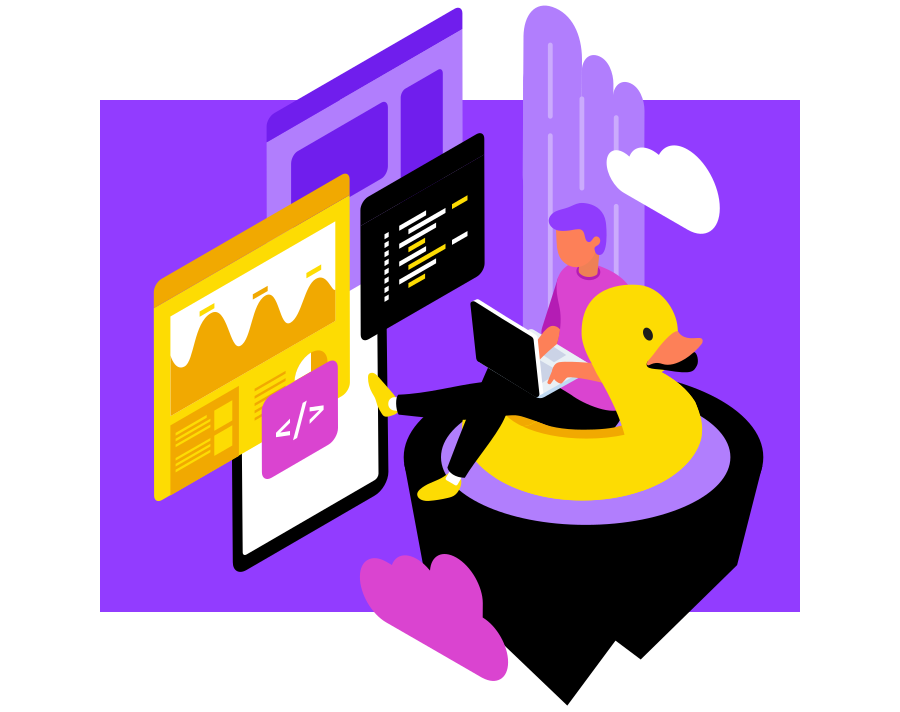

# Monitoring serverless apps



When clients have a bug, you can tell. Go through the flow, click around, see what happens.

But code on the server is invisible. And [always broken](/robust-backend-design). A distributed system is never 100% error-free.

A [good architecture](/serverless-architecture-principles) lets you ignore many errors. The system recovers on its own.

What about the bad errors? And how do you debug code you can't see?

## Observability

Observability is the art of understanding the internal state of a system based on its outputs. It's a continuous process.

A good system lets you:

- understand what's going on
- see trends
- figure out what happened after an error
- *predict* errors
- know when there's an emergency
- understand how to fix an emergency

Those are design goals. There is no right answer. Observability is an art and getting it right takes practice.

But there are guidelines you can follow. You'll need:

- **logs** are immutable events that happened in your system. They follow a structured format and offer information about what happened where and when.
- **metrics** are aggregate events over time. They tell you how much of what is happening, how long it takes, and help you understand trends.
- **traces** are journeys through the system. A sequence of events that contributed to a bigger result.

<div id="lock" />

### Questions to ask yourself

Observability is part of your development process. You can't tack it on later. 

I like to ask these questions when building:

1. How will I know this works?
2. How will I know this broke?
3. How will I deduce where it broke?
4. How will I figure out how it broke?
5. How will I know which payload broke it?

There is no right answer. It takes a few emergencies to dial it in and save the info you need.

### When do you need observability?

Always. 😛

It depends. How critical is your software?

When you have 10 users, eh I'd focus on getting users. When you have 100 users, eh they'll tell you when there's a bug.

You'll see stranger and stranger bugs the more users you have. A 1-in-1000 bug happens every day when you have 1000 users. At Google scale, tiny impossible to reproduce bugs happen every minute.

That's when observability shines. Understanding bugs you can't reproduce.

*PS: you don't need traditional "monitoring" in a serverless system. Your server is never down, your memory is never full, your storage never runs out, your CPU is never busy.*

<div id="lock" />

## What to measure

Deciding what to measure is a art. You'll get it wrong.

You build a system asking the 5 questions we mentioned. Add a bunch of measurements and walk away.

A few days pass and something goes wrong.

You go through the logs. There's too many. You ignore 80%. 

You realize the 20% that are useful don't have enough info. Despite your best efforts, you can't be certain what happened.

Adjust what you log, add the info you wish you had, remove the info you didn't need. Next time will be better.

It's an iterative process :)

### Typical useful logs and events

You need two types of logs:

1. The system is ticking along
2. Errors

Happy logs work like breadcrumbs. 

You leave them behind so you can later trace a path through the system. How did this user get into that state? Are we seeing bottlenecks? Did event B that always comes after event A suddenly stop coming?

You want to know when a typical behavior changes.

Errors, always log errors. Add as much debugging info as possible. Print the whole stack trace, the exact error, and any identifiers you'll need to reproduce the bug.

### Metrics to track

Specific metrics depend on what you care about. 

Got a function that needs to be fast? Measure its speed. Got a suspected bottleneck? Measure requests waiting. Got a flaky process? Measure error rate.

At the least, you'll want to measure 3 metrics for each part of your system:

1. Throughput – how many requests are you processing
2. Error rate – how many errors happen
3. Failure rate – how many requests never succeed

"Part of the system" means an end-to-end process as seen by a user. Don't sweat individual pieces unless you identify a problem and need a closer look.

### When to alarm

Metrics help when you look at them, logs help when you're solving a problem. Alarms come to you.

I like to use an escalating system:

- email for small problems
- slack when the fire grows
- SMS for critical issues

You'll want to set alarms for high error and failure rates (depends what you consider high) and anomalies in throughput. When a 100/hour event drops to zero, something's wrong.

How to set alarms depends on your tool of choice. On AWS, CloudWatch has basic support and I've used DataDog with great success in the past. Anomaly detection on DataDog is wonderful.

## Distributed logging

Logging is the core of your observability toolbox. Metrics and traces build on top of logs.

But in a serverless system, you can't sign into a server to see the logs. There's no server and your system is distributed across many services.

You'll need a distributed logging system. A way to collect logs from every service and save them in a central location.

On AWS, you can achieve this through CloudWatch. A service that collects output from your lambdas and offers a basic UI.

### StatsD

When you outgrow default CloudWatch metrics and need deeper insights, there's a rich ecosystem of tools and resources waiting for you. Built on top of a de facto standard: [StatsD](https://github.com/statsd/statsd).

StatsD is an open source agent that listens for prints in a specific format to collect as metrics. It sends those to a central location without interfering with your code.

You can [use StatsD with CloudWatch](https://docs.aws.amazon.com/AmazonCloudWatch/latest/monitoring/CloudWatch-Agent-custom-metrics-statsd.html) to collect custom metrics. These populate in the CloudWatch UI.

Print logs like this:

```
console.log("MetricName:value|type|sample_rate|tag1,tag2")
```

Sample rate and tags are optional.

When you print in that format, you can connect a number of 3rd party tools that give you power beyond the CloudWatch UI. DataDog has been a great choice for me.

## Make a pulse dashboard

The final step in your observability journey is a nice dashboard. Something you can look at, see wiggly lines, and say *"Yep, system's working"*

Dashboard your critical metrics. What you're focusing on *right now*. 5 or 6 at most.

You can build detailed dashboards for specific parts of your system. That comes when your project grows.

A typical core dashboard includes:

- global request throughput
- global error rate
- global failure rate
- response times

And remember: A metric that isn't actionable is vanity and should be removed.

Next chapter we look at the split between localhost and production.