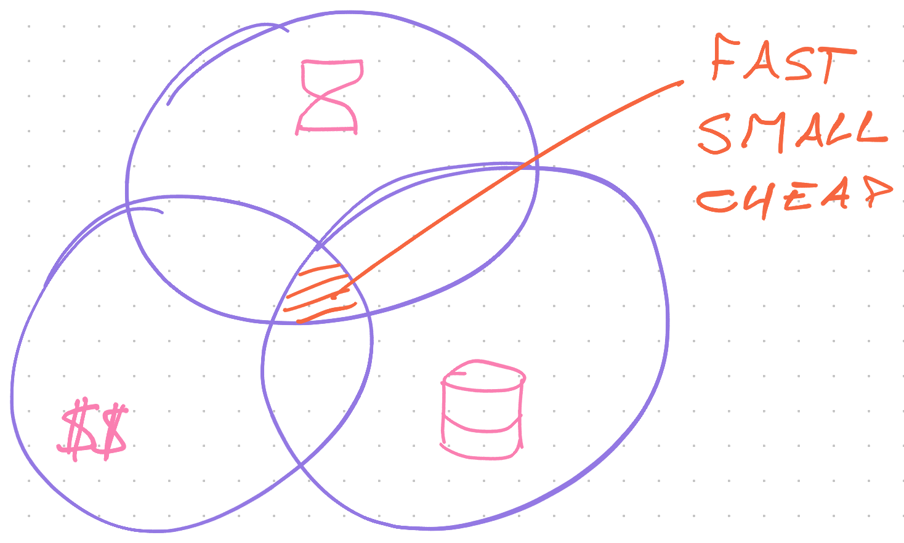
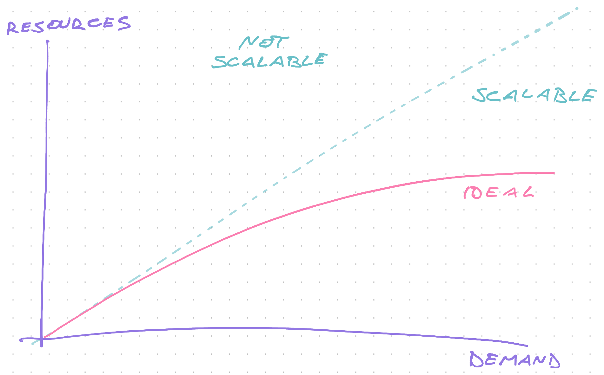

# Serverless performance


Performance talks about results per unit of a resource. Time, effort, space, energy, and money.

How much of X does it take to get N results?

We've touched on performance before. Mentioned scaling strategies in [Pros and Cons of Serverless](/serverless-pros-cons) and [Databases](/databases), talked about complexity in [Lambda Pipelines](/lambda-pipelines), and mentioned flow in [Robust Backend Design](/robust-backend-design).

But what do you measure? What's achievable? Where do you optimize? How does serverless stack up?

## The performance trifecta

Software systems care about time, money, and space. You have to balance all 3.



With metered pricing, serverless lets you pay directly for execution time, memory size, and storage space. No overhead. You don't use it, you don't pay it.

AWS Lambda charges for execution time with [millisecond precision](https://aws.amazon.com/blogs/aws/new-for-aws-lambda-1ms-billing-granularity-adds-cost-savings/).

**Faster code** uses more memory to gain speed. Or you can beef up CPU. Both make your code more expensive to run.

**Saving storage space** costs CPU time to compress and clean data. Storage is cheap. Bandwidth to and from storage gets pricey.

You **optimize memory** with slower code. Memory is plentiful these days, but not in serverless. You want small functions.

Every optimization takes **human time and effort**. A metric that software _organizations_ care about. How hard is the code to develop and maintain?

You can think of performance as a 4-dimensional optimization function. **Speed vs. space vs. money vs. human effort**. Great question for a calculus exam.

Avoid doing the calculus with ye olde law of prioritization:

1. Make it work
2. Make it right
3. Make it fast

You'll find that computers are fast & cheap and humans are slow & expensive. Stick to 1, add 2 for easier maintenance. 3 when necessary.

### Where size matters

Storage is cheap – [$0.023/GB/month on S3](https://aws.amazon.com/s3/pricing/) – and memory is _pretty_ cheap at [$0.000016/GB/second](https://aws.amazon.com/lambda/pricing/). Memory cost _increases_ when you need extra. Storage cost _decreases_ when you use more.


_Bandwidth_ is where size gets you. AWS charges for taking data out of the system. Other providers are similar.

You pay to send data to users or between availability zones. Details depend on which services are involved. For example: S3 to CloudFront (the CDN) is free, then CloudFront charges $0.085/GB.

Minimize what you send over the wire.

## Thinking about speed

You measure speed with 2 metrics:

1. Latency
2. Throughput

Best summarized with a metaphor from [Andrew S. Tanenbaum](https://en.wikipedia.org/wiki/Andrew_S._Tanenbaum):

> Never underestimate the bandwidth of a station wagon full of tapes hurtling down the highway

<div id="lock" />

### Latency

Latency measures delay. How long does it take to start working?

You can write the fastest code in the world, but if it needs 2 seconds to get started ... unhappy users.

Biggest factors are:

- network time
- internal routing
- lambda wake up time

**Network time** measures how long it takes for a user's request to reach your server. Depends on distance and connection quality.

**Routing** is internal to your serverless provider. How long does it take to accept a request and send it to your code? Security rules can make this slower or faster.

**Lambda wake up time** measures how long it takes to spin up your tiny server. Depends on bundle size, runtime environment, and how your code warms up.

### Throughput

Throughput measures how fast you work. When you get a request, how long does it take?

Biggest factors are:

- code performance
- input/output

Serverless is for [small distributed operations](/lambda-pipelines). Code performance and algorithm complexity have little impact.

> Fancy algorithms are slow when n is small, and n is usually small. Fancy algorithms have big constants. Until you know that n is frequently going to be big, don't get fancy.
> ~ [Rob Pike](https://en.wikipedia.org/wiki/Rob_Pike)

That leaves **input/output**.

Waiting for a database, talking to 3rd party APIs, loading a web page, those will _destroy_ your performance. For example: the average duration for my screenshot lambda is 10 seconds. Mostly waiting for Chrome to start and webpages to load.

You pay for every millisecond of that wait. 🙃

## Thinking about scalability

[Scalability](https://en.wikipedia.org/wiki/Scalability) talks about how your system behaves as load grows.

What happens at 10 requests per day? What about 10,000,000?

Your system is considered scalable, if resources grow linearly or less with demand. Using 1 lambda per request may not be cheap, but it does scale.

A system that grows faster than demand blows up eventually.



This applies to teams as much as it does to computers. If you need 3 new developers to do 2x more work, your company will die.

Scaling your software comes in 2 flavors: vertical and horizontal. You'll use a mix of both.

### Vertical scaling

Vertical scaling is the art of getting 1 computational resource to do more. Physical machine, virtual machine, or CPU thread.

This type of scaling is expensive. You need more resources – faster CPU, more memory, better hardware, a GPU – and lots of engineering effort to optimize your code.

For many workloads, this approach is best.

It's easier to scale a database by adding CPU and memory than by rebuilding your application to split data. AI researchers prefer a computer with terabytes of memory over tweaking algorithms to use less.

And sometimes it's the only way. Like processing 1 video.

### Horizontal scaling

Horizontal scaling is the art of splitting work between computational resources. Physical machines, virtual machines, or CPU threads.

This type of scaling is cheap. Easier to provision, quicker to get going, less effort to optimize.

But you have to find a balance. 6 cheap computers can cost more than 3 expensive computers.

And that's where serverless shines.

You let somebody else worry about the balance. Cloud functions are small and AWS can stuff them on a beefy machine.

Horizontal scaling is perfect for isolated operations with little inter-dependency. Like API requests, processing a video library, or serving static files. You can handle each piece on its own.

Use the [map-reduce pattern](/lambda-pipelines) to split larger tasks like we did in the [Lambda Pipelines chapter](/lambda-pipelines). You pay with system complexity.

## Achieving speed

Never optimize your code until it tells you where it hurts. Bottlenecks are surprising and unpredictable. Measure.

But don't kick the table with your pinky toe either. You already know that hurts.

For max speed in serverless environments you focus on:

- cold wake up times
- reducing input output
- fast simple code

### Cold wake up times

Traditional servers split performance into warm and cold. The server starts cold and warms up its caches, algorithm setup, and execution environment with the first few requests.

Most requests reach a warm server. Orders of magnitude faster.

You don't have that luxury with serverless. Every request is cold.


There is no one solution I can give you. Optimizing cold boot performance takes work and understanding _your_ software.

A few areas to look at:

- Use a language with a **fast and nimble runtime**. JavaScript is surprisingly effective, Go can work great. JVM-based languages tend to struggle.
- **Ruthlessly reduce bundle size**. The less code that needs to load, the better. Compile and minimize your source, [remove un-needed dependencies](https://www.serverless.com/framework/docs/providers/aws/guide/packaging#package-configuration). Use the `exclude` config in `serverless.yml`.
- **Avoid fancy algorithms** with large constants. Iterating your data 5x to set up a fast algorithm may not be worth it. You're processing small payloads.

### Reducing input output

The biggest performance killer is input/output. Your tiny server comes with no batteries included.

Want to read from cache? Network request. Database? Network request. Call an API? Yep, network.

[Networks are slow](https://gist.github.com/hellerbarde/2843375). If reading a variable is like brushing your teeth, a roundtrip with your database is like a 6 day vacation. 🤯


Providers optimize these "external" requests but you have no control and there are hard limits at play.

Best you can do is minimize.

- do more in 1 request (bigger SQL queries, for example)
- avoid I/O in a loop, try to pre-fetch
- prefer local [memoization](https://en.wikipedia.org/wiki/Memoization) over cache

#### Memoization vs. cache

Memoization stores results in a local variable. Call your function with the same inputs and return the value without recalculating.

But you lose memory when the lambda goes to bed. That's where cache helps. A service with persistent memory that stores pre-computed values.

Like your database, the caching service is an external request. Much slower than a local variable.

Use memoization when you call the same code multiple times per request. Use cache when you need the same data across many requests.

When you get requests frequently enough, serverless providers start reusing your code between executions. Memoizing in "global" memory does wonders.

In pseudo-javascript:

```javascript
let memoized = null

exports.handler = function (argument) {
  if (!memoized) {
    memoized = expensiveComputation()
  }

  return memoized
}
```

### Fast simple code

Keep it simple.

Use the fastest check as your first argument in an `&&` or `||` chain. Computers skip arguments when they can't change the result.

Avoid doing work that you'll throw away 10 lines later.

An `O(n)` lookup is faster than building a hashmap in `O(n)` and reading it once.

## Optimizing flow

Once you've optimized individual components, you need to look at the performance of your system as a whole.

We look into flow in the next chapter – it's a major part of optimizing cost.
